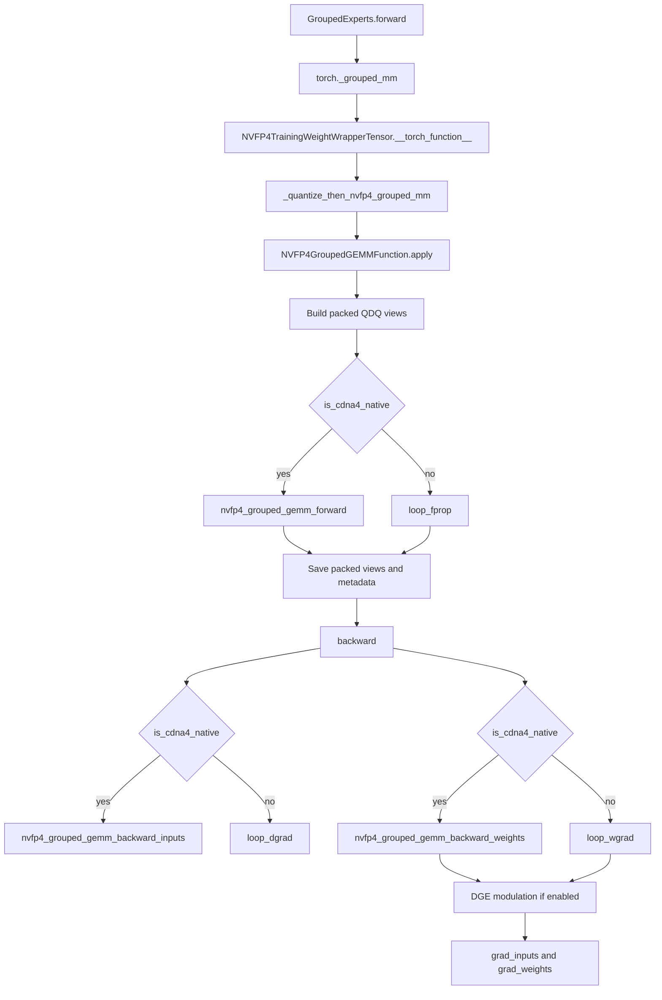

# NVFP4 Grouped GEMM Native Backend Design

## Goal

Move NVFP4 grouped GEMM from the current **QDQ -> BF16 grouped GEMM** backend
shape to a backend that is structurally comparable to MXFP4 grouped GEMM:

- grouped forward / dgrad / wgrad each have dedicated Triton entrypoints
- kernels consume **packed NVFP4 data + per-block scales (+ optional PTS)**
- dequantization happens **inside the grouped kernel**, not in a generic BF16
  grouped GEMM helper
- one unified autograd class selects native vs loop fallback explicitly

This is not yet a `tl.dot_scaled`-style native FP4 tensor core path like MXFP4,
because NVFP4 uses E4M3 block scales and optional per-tensor scale instead of
MXFP4's E8M0 exponent scales.  The target here is a **native NVFP4 grouped
kernel backend** in software-Triton form: packed NVFP4 data is the kernel input,
scale application is performed per tile inside the Triton kernel.

## Target architecture

### Execution backends

1. **Native NVFP4 grouped Triton backend**
   - enabled only when `is_cdna4() == True`
   - used for:
     - fprop (`2D x 3D`)
     - dgrad (`2D x 3D`)
     - wgrad (`2D x 2D`)
   - inputs are packed NVFP4 tensors plus per-block scales and optional
     per-tensor scales

2. **Loop fallback backend**
   - used on all non-CDNA4 environments
   - keeps semantics identical to the native path
   - no `.item()`-based per-group host syncs

### Unified autograd class

Replace the current split:
- `NVFP4GroupedGEMM`
- `NVFP4GroupedGEMMNative`

with a single class:
- `NVFP4GroupedGEMMFunction`

Its forward signature accepts either:
- `expert_indices` (public API / loop-oriented path), or
- `offs` (dispatch / sorted-by-expert path)

The backend selector derives:
- `native_available = is_cdna4()`
- `loop_requires_offsets_to_indices = offs is not None and not native_available`

## Data model and tensor layouts

### Logical operand layouts

#### Forward / dgrad primitive (`2D x 3D`)

- activations / grad_output:
  - logical shape: `[M_total, K]` or `[M_total, N]`
- expert weights for grouped forward kernel:
  - logical shape: `[E, N, K]`
  - grouped kernel consumes expert-major layout, one expert block at a time

#### Wgrad primitive (`2D x 2D`)

- grad_output (wgrad reduction view): `[M_total, N]`
- x_bwd: `[M_total, K]`
- output dW: `[E, N, K]` or `[E, K, N]` depending on `trans_weights`

### Packed NVFP4 representation

Per quantized tensor view we need:

- `data_lp` : packed uint8 with 2 FP4 values per byte
- `scales`  : float32 tensor holding E4M3-rounded block scales
- `pts`     : optional per-tensor scale scalar (`float32[1]` or `None`)

That yields the following per-view metadata:

| View | Data | Scales | Optional PTS |
|---|---|---|---|
| fprop activations | `x_lp` | `x_scales` | `x_pts` |
| fprop weights     | `w_lp` | `w_scales` | `w_pts` |
| dgrad weights     | `w_bwd_lp` | `w_bwd_scales` | `w_bwd_pts` |
| wgrad activations | `x_bwd_lp` | `x_bwd_scales` | `x_bwd_pts` |
| wgrad grad_output | `g_w_lp` | `g_w_scales` | `g_w_pts` |
| dgrad grad_output | `g_d_lp` | `g_d_scales` | `g_d_pts` |

## Quantization semantics

We keep the same **6-QDQ** semantics as linear:

1. fprop x   : axis = `-1`
2. fprop W   : axis = `quant_axis_w`
3. dgrad W   : axis = `requant_axis_w` (unless 2D block makes it axis-invariant)
4. wgrad x   : axis = `0` (unless `use_2dblock_x=True`)
5. dgrad g   : axis = `-1`
6. wgrad g   : axis = `0` (unless `use_2dblock_x=True`)

### Rounding policy

- forward quantization: RNE / deterministic
- backward grad quantization: SR when `use_sr_grad=True`

### 2D block scaling

- `use_2dblock_x=True`:
  - x / grad_output use square block scales
  - axis is effectively invariant for the QDQ view
- `use_2dblock_w=True`:
  - weight views are axis-invariant, so the same packed view may be reused for
    fprop and dgrad/wgrad when mathematically valid

### Hadamard

Mirror linear semantics:

- only valid when `use_2dblock_x=False`
- applies on the **wgrad reduction axis**
- forward:
  - transform `x` before the `axis=0` QDQ that builds `x_bwd`
- backward:
  - transform `grad_output` before the `axis=0` QDQ that builds the grouped
    wgrad operand
- preserves `(Hx)^T(Hg) = x^T g`

### DGE

Mirror linear semantics:

- save raw packed FP4 + scales for the weight view used on the wgrad side
- at backward end:
  - reconstruct FP4 bin values with unit scales via `convert_from_nvfp4`
  - multiply `grad_weights` by `dge_bwd(...)`

## Kernel interfaces

### Native forward

```python
nvfp4_grouped_gemm_forward(
    inputs_lp,           # [M, K/2]
    expert_weights_lp,   # [E, N, K/2] or [E, K/2, N]
    expert_indices,      # [M_total]
    input_scales,
    weight_scales,
    input_pts,
    weight_pts,
    trans_weights,
    use_2dblock_x,
    use_2dblock_w,
    output_dtype,
)
```

Kernel responsibilities:
- load packed FP4 x and W
- expand block scales (+ multiply optional PTS)
- unpack/dequantize inside the tile
- accumulate into BF16/FP32 output tile

### Native dgrad

```python
nvfp4_grouped_gemm_backward_inputs(
    grad_output_lp,
    expert_weights_lp,
    expert_indices,
    go_scales,
    weight_scales,
    go_pts,
    weight_pts,
    trans_weights,
    use_2dblock_x,
    use_2dblock_w,
    output_dtype,
)
```

### Native wgrad

```python
nvfp4_grouped_gemm_backward_weights(
    grad_output_lp_wgrad,
    inputs_lp_wgrad,
    expert_indices,
    num_experts,
    go_scales,
    input_scales,
    go_pts,
    input_pts,
    trans_weights,
    use_2dblock_go,
    use_2dblock_x,
    output_dtype,
)
```

## End-to-end call chain



## Backend selection logic

### Public grouped API (`expert_indices` path)
- if `is_cdna4()`:
  - use native Triton grouped kernels with `expert_indices`
- else:
  - use loop fallback with `expert_indices`

### Dispatch path (`offs` path)
- if `is_cdna4()`:
  - convert `offs -> expert_indices` on device using
    `create_indices_from_offsets_nosync`
  - use native Triton grouped kernels
- else:
  - convert `offs -> expert_indices` on device
  - use loop fallback

### Loop fallback replacement for `.item()`

Current loop path uses per-group:
```python
eid = expert_indices[s].item()
```

Replacement:
- reshape activations into `[num_groups, ALIGN_SIZE_M, ...]`
- build `group_expert_ids = expert_indices.view(num_groups, ALIGN_SIZE_M)[:, 0]`
- for each expert id in Python (small loop over experts, not groups), select the
  matching groups using a GPU boolean mask and run batched matmul on the grouped
  slices

This removes per-group host sync while keeping semantics unchanged.

## Shape / alignment contracts

### Required
- `M_total > 0`
- `M_total % ALIGN_SIZE_M == 0` for loop fallback and grouped semantics
- `M_total % 16 == 0` whenever an axis-0 NVFP4 QDQ view is required
- if `use_hadamard=True`, then `use_2dblock_x=False`
- grouped inputs must be contiguous in expert-group order

### Native kernel assumptions
- packed last dimension divisible by 2
- grouped expert blocks are contiguous
- `expert_indices` contiguous `int32`
- block-size compatibility with Triton tile sizes (`BLOCK_SIZE_* % QUANT_BLOCK_SIZE == 0` where needed)

## Test strategy

### Op-level
1. forward SNR / CosSim vs BF16 reference
2. full autograd (O / dX / dW)
3. grouped recipe smoke for:
   - 1D/1D
   - 1D/2D-w
   - PTS
   - Hadamard
   - DGE
   - Hadamard + DGE
   - Hadamard + DGE + PTS
4. grouped misaligned `M_total` raises
5. native-vs-loop numerical equivalence on aligned shapes
6. grouped single-expert == linear

### Protocol preflight before E2E
- step-0 `param.grad is not None`
- 1-step optimizer drift
- 200-step grouped-wrapper drift probe

### E2E
- 2K grouped-only screening:
  - BF16
  - MXFP4 grouped-only
  - NVFP4 recipe matrix
- choose top 2-3
- 5K grouped-only confirmation
- only then consider full-model follow-up
