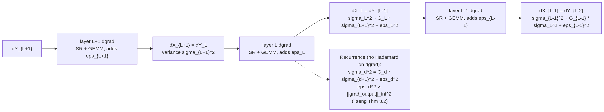
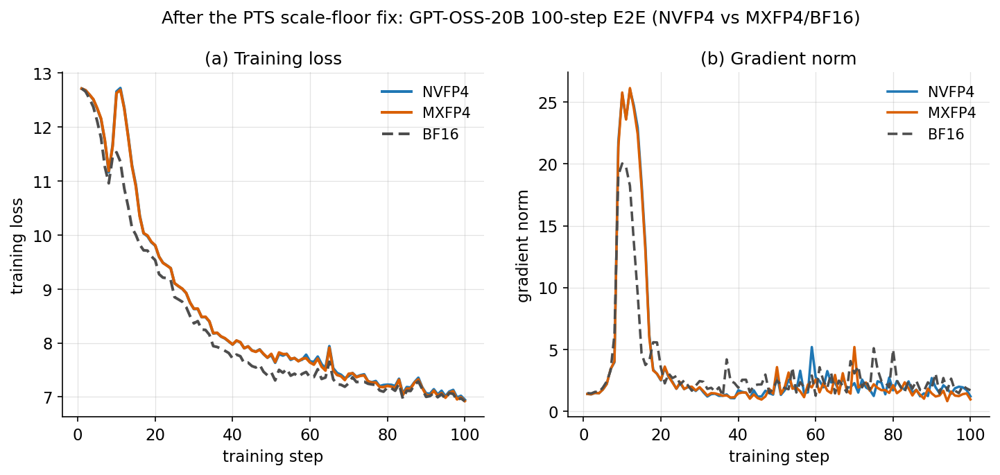
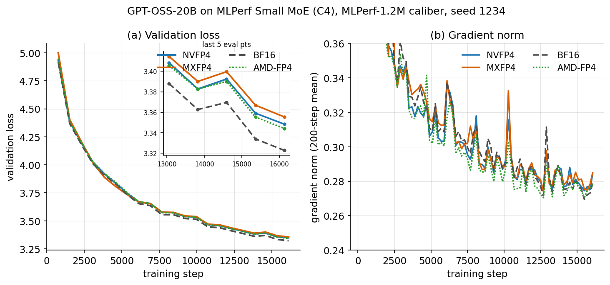
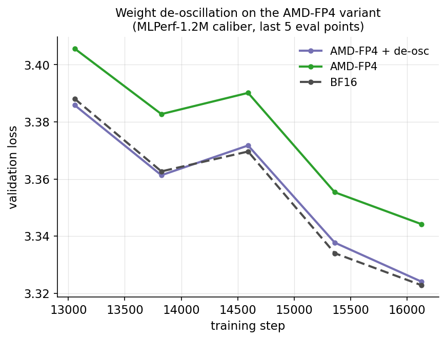

# Training LLM with NVFP4: Two-Level Microscaling, Numerical Stability, and Evaluation on the MLPerf Small MoE Benchmark

> **DRAFT v0.1 (2026-07-10).** Companion to the MXFP4 report (`../MXFP4/report.md`). All end-to-end results are on the same hardware generation (8×AMD MI300X) under the MLPerf-aligned 1.2M-step learning-rate schedule; multi-seed numbers are extracted from existing TensorBoard logs.

---

## Abstract

Training large language models in 4-bit floating point promises large memory and compute savings, but the choice of FP4 microscaling format materially affects accuracy. We present an open-source training recipe ([ALTO](https://github.com/AMD-AGI/ALTO)) for **GPT-OSS-20B**—a 20-billion-parameter mixture-of-experts (MoE) model—on the **MLPerf Small MoE** benchmark under the **NVFP4** microscaling format. NVFP4 encodes values as E2M1 with a **two-level scale**: a fine-grained E4M3 scale per 16-element block, normalized by a per-tensor FP32 outer scale. Relative to MXFP4 (32-element blocks with a power-of-two UE8M0 scale), the finer block size and the higher-resolution two-level scale reduce quantization error. Our recipe composes hybrid 1D/2D block quantization, randomized Hadamard transforms (RHT), and stochastic rounding (SR) from [arXiv:2509.25149] with an optional weight de-oscillation scheme from TetraJet-v2 [arXiv:2510.27527]. A central engineering contribution is diagnosing and fixing a **per-tensor-scale (PTS) quantization-spec bug** whose scale floor caused NVFP4 gradient norms to explode by 100–1000× on multi-layer MoE training; the fix restores BF16-level gradient stability. On C4 validation with global batch size 16, NVFP4 reaches a validation loss of **3.3459 ± 0.0024** (3 seeds) at the 16,128-step slice, within **0.0195** of the BF16 baseline (**3.3264 ± 0.0031**) and consistently below MXFP4 (**3.3548 ± 0.0016**) on every seed. We report operator-level SNR against BF16 under both a synthetic injected-outlier protocol and a real-activation protocol, and we characterize the already-merged AMD-FP4 (UE5M3 inner scale) variant. All experiments use fake-quantized NVFP4 kernels; because the current native FP4 GEMM path does not support NVFP4's continuous scales, execution is quantize–dequantize (QDQ) emulation and wall-clock speed is not optimized.

---

## 1. Introduction

Low-precision training has progressed from FP16 and BF16 to FP8 and, recently, 4-bit floating-point formats. Two 4-bit microscaling families are now prominent: the Open Compute Project (OCP) **MXFP4** format (32-element blocks, power-of-two UE8M0 block scale) and NVIDIA's **NVFP4** format (16-element blocks, an E4M3 block scale normalized by a per-tensor FP32 outer scale). Both encode elements as E2M1 (one sign, two exponent, one mantissa bit; magnitudes in $\{0,0.5,1,1.5,2,3,4,6\}$). For sparse MoE models such as GPT-OSS-20B, where expert matrices dominate compute and memory, 4-bit training could unlock disproportionate efficiency gains.

The two formats trade off differently. MXFP4's UE8M0 scale is a pure power of two: cheap and directly consumable by a native power-of-two-scaled FP4 GEMM, but coarse. NVFP4's two-level scale carries mantissa bits (E4M3) and a continuous per-tensor normalizer, giving finer resolution and better outlier absorption—at the cost that the current native FP4 GEMM path supports only power-of-two scales, so NVFP4 cannot use it and must run as software QDQ emulation.

| Property | MXFP4 | NVFP4 |
|---|---|---|
| Inner block size | 32 | **16** (finer) |
| Inner (block) scale | E8M0 power-of-two (uint8) | **E4M3** (max 448), stored in FP32 |
| Outer scale | none | **per-tensor FP32** (two-level scaling) |
| Native FP4 GEMM support | yes | **no** — software QDQ emulation |
| Dominant error | resolution | resolution + dynamic range |

This report describes ALTO's methodology for NVFP4 training on the MLPerf Small MoE task. Hybrid 1D/2D block quantization, RHT, and SR are adopted from [arXiv:2509.25149]; weight de-oscillation is adapted from TetraJet-v2 [arXiv:2510.27527]. Our contributions are: (i) a composable NVFP4 training recipe for MX-style MoE models implemented in a unified kernel and modifier stack; (ii) the diagnosis and fix of a PTS scale-floor bug that otherwise makes multi-layer NVFP4 MoE training diverge (Section 3.5); and (iii) a systematic NVFP4-vs-MXFP4 comparison at the operator level (synthetic and real data) and end-to-end (multi-seed, MLPerf-aligned). ALTO also supports replacing the E4M3 inner scale with the wider-range UE5M3 grid—the already-merged **AMD-FP4** variant—which we report as a reference point (Section 4.1). We state explicitly where the implementation remains a research prototype rather than a performance-optimized production system.

---

## 2. Problem Setting

### 2.1 Benchmark: MLPerf Small MoE

We evaluate on the **MLPerf Small MoE** training benchmark, which specifies pretraining of a sparse MoE LLM on a subset of the C4 dataset. Our target model is **GPT-OSS-20B** (~20.9B parameters, ~3.6B active per token), an open-source MoE architecture released by OpenAI. The official MLPerf task is a BF16 workload; running FP4 under its protocol is an internal research exercise on capability and convergence, not a compliant MLPerf submission.

### 2.2 Training Protocol

Training hyperparameters follow the ALTO configuration `gpt_oss_20b_lpt`:

| Hyperparameter | Value |
|----------------|-------|
| Training / validation data | Pre-tokenized C4 subset / C4 validation set |
| Sequence length | 8,192 tokens |
| Global batch size | 16 (local batch 1, gradient accumulation 2) |
| LR-decay horizon | **1,200,000 steps** (MLPerf-aligned cosine), run as a 16,128-step slice |
| Base / min learning rate | $4\times10^{-4}$ / $4\times10^{-5}$ (min-LR factor 0.1) |
| Scheduler / warmup | cosine decay / 128 steps |
| Optimizer | AdamW ($\beta_1{=}0.9,\ \beta_2{=}0.95,\ \varepsilon{=}10^{-5}$, weight decay 0.1), grad-norm clip 1.0 |
| Parallelism | expert parallelism 8; tensor parallelism 1; FSDP shard 8; activation checkpointing none |
| Validation | every 768 steps, 64 validation steps; seeds 1234 / 2024 / 4242 |

Two protocol points are essential for comparability. First, the learning-rate cosine decays over the **MLPerf 1.2M-step horizon**; we run only the first **16,128 steps**, so the learning rate remains near its peak throughout—matching the MLPerf reference regime. All results in this report use this single caliber. Second, validation uses a **rewind dataloader** (torchtitan `82084e7`): each evaluation rebuilds the dataloader from the start of the validation set, so every eval point scores the same fixed samples, as MLPerf requires.

NVFP4 is applied to all `Linear` layers and `GptOssGroupedExperts` modules; the `lm_head` projection and MoE router gates are kept in BF16, as routing is sensitive to small perturbations.

### 2.3 Evaluation Methodology

We evaluate at two levels.

**Operator-level SNR.** We verify that ALTO's NVFP4 Linear and grouped-GEMM autograd paths reproduce a high-precision reference. Each configuration runs a forward pass and a full backward pass, comparing the NVFP4 outputs and gradients against a BF16 reference. We report signal-to-noise ratio in decibels,

$$
\mathrm{SNR} = 10 \log_{10} \frac{\sum_i \mathbf{X}_i^2}{\sum_i (\mathbf{X}_i - \hat{\mathbf{X}}_i)^2},
$$

computed in FP32, for forward output $\mathbf{O}$, input gradient $\mathrm{d}\mathbf{X}$, and weight gradient $\mathrm{d}\mathbf{W}$. We use **two data protocols**: (a) a *synthetic injected-outlier* generator identical to the MXFP4 report—each tensor is $\mathbf{T} = \mathcal{N}(0,1) + \mathrm{Bernoulli}(0.005)\odot\mathcal{N}(0,10^4)$, i.e. ~0.5% of elements receive a ~100× heavy-tail perturbation; and (b) a *real-activation* protocol that feeds real C4 batches through the true GPT-OSS-20B forward/backward with HF BF16 weights, capturing $x/w/y/\mathrm{d}y$ at representative layers (L1/L12/L20) for attention `wq` (dense) and MoE `experts` (grouped GEMM).

**End-to-end.** We report validation cross-entropy on the held-out C4 set at fixed step checkpoints. The BF16 baseline uses identical data, hyperparameters, and parallelism, differing only in the absence of FP4 quantization.

---

## 3. Method

The recommended NVFP4 recipe (`nvfp4_alllayers_rank0.yaml`) enables hybrid block quantization, RHT, SR, and the two-level tensorwise scale; weight de-oscillation is optional.

### 3.1 NVFP4 Two-Level Microscaling Format

NVFP4 partitions each tensor into blocks of **16 consecutive elements** and quantizes each element to E2M1. Unlike MXFP4's single power-of-two scale per block, NVFP4 uses a **two-level scale**: a per-block **inner** scale $s_{\mathrm{inner}}$ on the E4M3 grid (a general float, max 448), and a per-tensor **outer** scale $s_{\mathrm{outer}}$ in FP32 (the NVFP4 spec's $s_{\mathrm{global}}$). The outer scale first normalizes the tensor to a magnitude the E4M3 grid can represent precisely; the inner scale then exploits E4M3's mantissa bits for fine per-block resolution. Given a tensor with maximum magnitude $a=\max_i|x_i|$ and a block with maximum $b$,

$$
s_{\mathrm{outer}} = \frac{a}{448 \times 6} = \frac{a}{2688}, \qquad
s_{\mathrm{inner}} = \mathcal{Q}_{\mathrm{E4M3}}\!\left(\mathrm{clip}\!\left(\frac{b}{6\, s_{\mathrm{outer}}},\ [\varepsilon_{\mathrm{E4M3}},\ 448]\right)\right),
$$

$$
\hat{x}_i = \mathcal{Q}_{\mathrm{E2M1}}\!\left(\frac{x_i}{s_{\mathrm{inner}}\, s_{\mathrm{outer}}}\right), \qquad
\tilde{x}_i = \hat{x}_i \cdot s_{\mathrm{inner}}\, s_{\mathrm{outer}},
$$

where $6$ is the largest E2M1 magnitude and $\varepsilon_{\mathrm{E4M3}}$ is the smallest E4M3 normal. The outer scale is floored at $10^{-30}$ purely as a divide-by-zero guard (Section 3.5 explains why this floor, not the E4M3 floor, is the correct one).

As illustrated in Figure 1, each linear layer has three underlying GEMMs: a forward GEMM producing $\mathbf{O}$, and backward GEMMs producing $\mathrm{d}\mathbf{X}$ and $\mathrm{d}\mathbf{W}$. Because the current native FP4 GEMM path accepts only power-of-two scales, NVFP4 cannot use it; ALTO performs **fake quantization**—operands are quantized to NVFP4 and immediately dequantized to BF16 before a standard high-precision GEMM (`BF16 → quant → FP4 → dequant → BF16 → GEMM`)—faithfully reproducing FP4 numerical error without realizing memory-bandwidth savings (Section 6).

**Figure 1.** NVFP4 two-level-scale compute flow across the three GEMMs (forward + backward).

  

### 3.2 Hybrid 1D/2D Block Quantization

Following [arXiv:2509.25149], we adopt a **1D–2D hybrid** layout. Activations use 1D blocks (1×16 along the contraction axis), which keeps them compatible with the RHT on the activation-gradient path (Section 3.3). Weights use 2D blocks (**16×16**), so a single quantized weight is valid for both the forward orientation and the transposed backward orientation, eliminating axis-dependent re-quantization. (MXFP4 uses 32×32 weight blocks.) For MoE grouped GEMM, expert weights $\mathbf{W}\in\mathbb{R}^{E\times N\times K}$ receive 2D blocking on the trailing two dimensions, quantized once and reused across forward (contract $K$) and backward (contract $N$).

### 3.3 Randomized Hadamard Transform (RHT)

A few large-magnitude activations inflate the per-block scale and compress the rest. Following [arXiv:2509.25149], ALTO applies a **randomized Hadamard transform** on the weight-gradient path (`use_hadamard`): activations and output gradients are multiplied by a $32\times32$ random Hadamard matrix $\mathbf{H}$ before quantization. Because $\mathbf{H}$ is orthogonal, $\mathrm{d}\mathbf{W} = (\mathbf{H}\mathrm{d}\mathbf{O})^\top(\mathbf{H}\mathbf{X}) = \mathrm{d}\mathbf{O}^\top\mathbf{X}$ in expectation, so the transform redistributes outlier energy without changing the underlying gradient. RHT is applied on the 1D activation path and is therefore mutually exclusive with 2D activation blocking, motivating the hybrid layout of Section 3.2.

### 3.4 Stochastic Rounding on Gradients (SR)

Deterministic round-to-nearest of gradients systematically rounds small components toward zero. ALTO uses **stochastic rounding** (`use_sr_grad`) during backward gradient quantization: each element rounds up or down with probability proportional to its fractional distance to the two adjacent representable values, yielding an unbiased estimator. Forward-pass quantization of weights and activations remains deterministic. SR interacts strongly with the scale spec of Section 3.5: on a broken scale grid, SR injects variance proportional to the (inflated) scale squared.

### 3.5 PTS Quantization-Spec / Scale-Floor Fix

This section describes the single most important numerical-stability result specific to NVFP4.

**Symptom.** On GPT-OSS-20B MoE, once more than one layer was converted to NVFP4, cumulative gradient norm exploded from a healthy $\approx 1.4$ to **1067–2178**, while MXFP4 with the identical SR/Hadamard recipe stayed at $\approx 1.4$.

**Root cause.** The per-tensor (outer) scale was clamped to the smallest E4M3 normal, $\varepsilon_{\mathrm{E4M3}} = 0.015625$. But backward output-gradient tensors have true maxima around $10^{-3}$–$10^{-5}$, so the spec-correct outer scale $a/2688$ falls in $10^{-7}$–$10^{-9}$—four to six orders of magnitude *below* the clamp. The clamp inflated the outer scale by a factor $R\approx1.5\times10^6$, collapsing every block's inner scale onto the E4M3 floor and destroying the quantization grid. Because SR variance scales as $O(s^2)$, an $R$-fold scale inflation amplifies gradient-quantization variance by $R^2\approx2.4\times10^{12}$, which then compounds through the MoE grouped-GEMM backward chain across layers.

**Decisive experiment.** A single-knob ablation (`pts_no_clamp`) that removed *only* the FP32 lower clamp—keeping all block-scale clamping and E4M3 rounding—dropped cumulative gradient norm from **656.67 to 1.42**, matching the BF16/MXFP4 baseline exactly.

**Fix.** We (i) replace `clip(min=ε_E4M3)` on the outer scale with `clip(min=1e-30)` (a divide-by-zero guard only), and (ii) reorder the quantization to the spec order—normalize by the outer scale *first*, then a single clamp-and-round for the inner E4M3 scale. Post-fix, the six-cut cumulative gradient norm returns to $\approx 1.41$ and the full operator-level suite passes (345 tests). Figure 2 shows the restored loss/gradient stability.

**Figure 2.** Loss and gradient-norm stability after the PTS scale-floor fix (100-step E2E; NVFP4 vs BF16/MXFP4).

  

### 3.6 Weight De-Oscillation (Optional)

Master weights near a quantization bin boundary can oscillate—$Q(w)$ flips between adjacent bins under infinitesimal AdamW updates. ALTO implements a simplified **OsciReset** from TetraJet-v2 [arXiv:2510.27527] as a post-AdamW hook (`deosc_step` / `deosc_period` / `deosc_ratio`, default 2000 / 200 / 4.0): over a window it accumulates per-element FP travel $d_w$ and quantized travel $d_Q$, flags elements with $d_Q/d_w \ge \tau$, and snaps them to their bin center ($w \leftarrow Q(w)$). The hook supports both NVFP4 and AMD-FP4 wrappers, including the grouped-expert reduction axis. Its end-to-end effect at MLPerf caliber is demonstrated on the AMD-FP4 variant in Section 5.3.

---

## 4. Additional Directions

### 4.1 AMD-FP4 (UE5M3 Inner Scale)

AMD-FP4 is a peer FP4 recipe (merged into ALTO's `main`) that reuses NVFP4's block-quant and GEMM kernels but replaces the E4M3 inner-block scale with **UE5M3** (unsigned E5M3, max normal 114688, ~256× wider dynamic range). It is selected by `scheme: "amdfp4"`; the scheme alone determines the inner-scale grid (NVFP4 → E4M3, AMD-FP4 → UE5M3), and every other recipe field is identical. The wider inner-scale range directly mitigates NVFP4's dynamic-range pressure in the *plain* (no-outer-scale) operator regime; once the two-level outer scale is enabled (the production default), AMD-FP4 and NVFP4 converge in operator SNR and end-to-end loss (AMD-FP4 is marginally ahead; Sections 5.1–5.2). We report AMD-FP4 as a merged variant and reference point, not as a separate main line.

### 4.2 Exploratory Directions (Not Released)

Several NVFP4-specific techniques were prototyped but are **not released as production features**, and we mention them only briefly. *Outer-block (double-block) scaling* [arXiv:2510.27527] replaces the per-tensor outer scale with a per-block FP32 scale; while it helps under heavy-tail synthetic stress, it shows no measurable end-to-end gain once RHT is enabled (RHT already removes the outliers it targets). *Four-over-Six (4/6)* [arXiv:2512.02010] adaptively maps each activation block's maximum to 4 or 6; its effect is directionally positive but negligible at the current 16k-step scale. *Uniform-grid FP4 (E1M2/INT4) with full-path RHT* removes E2M1's shrinkage bias in CPU diagnostics but is not yet evaluated end-to-end. *Low-rank (decomposed-linear) outlier compensation* is usable (`lora_rank`, multiple of 16) but not part of the recommended recipe. Differential gradient estimation (DGE) is available but, as in MXFP4, is not beneficial at this scale; static/dynamic clipping is not implemented for NVFP4.

---

## 5. Results

### 5.1 Operator-Level Numerical Accuracy

**Synthetic injected-outlier protocol.** Table 1 reports SNR of the NVFP4 linear autograd path against a BF16 reference at two contraction sizes. NVFP4 is strongly ahead of MXFP4 on the forward output and on small/medium-$K$ backward (+4 to +9 dB), reflecting the finer 16-element block and higher-resolution scale. At large $K$ (2048), NVFP4's backward $\mathrm{d}\mathbf{X}/\mathrm{d}\mathbf{W}$ fall 3–5 dB *below* MXFP4: the E4M3 block scale absorbs large-$K$ reduction outliers less well than MXFP4's coarser scale, and SR adds noise on top. ALTO encodes this as a known, $K$-aware SNR threshold rather than a bug.

**Table 1.** NVFP4 vs MXFP4 SNR (dB) on synthetic injected-outlier data (linear autograd; $\mathbf{O}/\mathrm{d}\mathbf{X}/\mathrm{d}\mathbf{W}$).

| $K$ | SR | Metric | NVFP4 | MXFP4 | $\Delta$ (NV−MX) |
|---:|:--:|:--|---:|---:|---:|
| 128 | off | $\mathbf{O}$ | **24.58** | 15.30 | +9.28 |
| 128 | off | $\mathrm{d}\mathbf{X}$ | **19.48** | 13.74 | +5.74 |
| 128 | off | $\mathrm{d}\mathbf{W}$ | **19.66** | 13.94 | +5.72 |
| 128 | on | $\mathbf{O}$ | **19.79** | 15.30 | +4.49 |
| 128 | on | $\mathrm{d}\mathbf{X}$ | **17.81** | 13.02 | +4.79 |
| 128 | on | $\mathrm{d}\mathbf{W}$ | **17.68** | 13.37 | +4.31 |
| 2048 | off | $\mathbf{O}$ | **23.80** | 15.84 | +7.96 |
| 2048 | off | $\mathrm{d}\mathbf{X}$ | 8.73 | **13.63** | −4.90 |
| 2048 | off | $\mathrm{d}\mathbf{W}$ | 10.32 | **15.08** | −4.76 |
| 2048 | on | $\mathbf{O}$ | **17.67** | 15.84 | +1.83 |
| 2048 | on | $\mathrm{d}\mathbf{X}$ | 8.65 | **12.30** | −3.65 |
| 2048 | on | $\mathrm{d}\mathbf{W}$ | 10.11 | **14.03** | −3.92 |

**Real-activation protocol (production-aligned).** Table 2 reports SNR on tensors captured from the true GPT-OSS-20B forward/backward, in the deployment configuration (2D weight blocks + RHT + SR; NVFP4's two-level outer scale is the only differentiator from MXFP4). Here **NVFP4 is at or above MXFP4 on every measured quantity**, by +0.4 to +12.2 dB, with the largest gains on deep-layer weight gradients. The MoE-expert forward output—NVFP4's weakest quantity in a bare-format analysis—roughly doubles in absolute SNR once the outer scale is enabled (e.g., L12 6.0→11.3 dB), because the two-level scale is exactly what lets the E4M3 block scale cover heavy-tail dynamic range while preserving FP4 precision.

**Table 2.** NVFP4 vs MXFP4 vs AMD-FP4 SNR (dB) on real GPT-OSS-20B activations, deployment config. Dense `wq` reports $\mathbf{O}/\mathrm{d}\mathbf{X}/\mathrm{d}\mathbf{W}$ (SR on for backward); MoE `experts` reports forward $\mathbf{O}$.

| Layer | $\mathbf{O}$ (NV / MX / AMD) | $\mathrm{d}\mathbf{X}$ (NV / MX / AMD) | $\mathrm{d}\mathbf{W}$ (NV / MX / AMD) | MoE $\mathbf{O}$ (NV / MX / AMD) |
|---|---|---|---|---|
| L1  | 15.28 / 11.68 / 15.28 | 12.46 / 10.22 / 12.08 | 17.31 / 15.82 / **18.40** | 8.98 / 8.59 / 8.98 |
| L12 | 17.67 / 14.10 / 17.67 | 12.11 / 9.65 / **12.39** | 23.53 / 18.66 / **24.31** | 11.32 / 10.51 / 11.32 |
| L20 | 17.94 / 13.87 / 17.94 | 6.47 / 3.25 / 6.24 | 29.42 / 19.60 / **31.22** | 10.56 / 9.08 / 10.56 |

*Discussion.* The synthetic and real protocols agree on the headline: with the production recipe, NVFP4's two-level scale gives it an operator-level fidelity advantage over MXFP4 across the network, most decisively on weight gradients. AMD-FP4 tracks NVFP4 in the deployment configuration (forward output identical; weight gradients marginally higher), confirming that once the outer scale is present the inner-grid choice (E4M3 vs UE5M3) is no longer the determining factor.

### 5.2 End-to-End Training

We pretrain GPT-OSS-20B from scratch under the protocol of Section 2.2, using fake-quantized NVFP4 for all Linear and grouped-expert layers (except `lm_head` and router gates). Figure 3 shows the four-way validation-loss and gradient-norm curves for seed 1234; AMD-FP4 is included as the merged-variant reference.

**Figure 3.** Validation loss and gradient norm on MLPerf Small MoE (GPT-OSS-20B, C4 subset), MLPerf-1.2M caliber, seed 1234.

  

The ordering is **BF16 < NVFP4 < MXFP4** at every one of the last five evaluation points, and gradient norm converges to $\approx 0.28$ for all formats with no spikes. Table 3 lists the seed-1234 trajectory over the last five eval points.

**Table 3.** Validation loss, seed 1234 (last five eval points).

| step | NVFP4 | MXFP4 | BF16 | AMD-FP4 (ref) |
|---:|---:|---:|---:|---:|
| 13056 | 3.4084 | 3.4145 | **3.3881** | 3.4056 |
| 13824 | 3.3828 | 3.3901 | **3.3627** | 3.3827 |
| 14592 | 3.3925 | 3.3996 | **3.3696** | 3.3901 |
| 15360 | 3.3591 | 3.3670 | **3.3340** | 3.3554 |
| **16128** | **3.3484** | 3.3555 | **3.3228** | 3.3442 |

**Multi-seed.** Table 4 aggregates three seeds (1234 / 2024 / 4242) at the 16,128-step checkpoint, extracted from the completed MLPerf-caliber runs. NVFP4 sits **0.0195** above BF16 and **0.0089** below MXFP4 in the mean, and it beats MXFP4 on all three seeds individually; its seed variance ($\pm 0.0024$) is smaller than the NVFP4–MXFP4 gap, so the ordering is robust.

**Table 4.** Validation loss at 16,128 steps, mean ± std over seeds (MLPerf-1.2M caliber).

| Format | seeds | val loss (mean ± std) | $\Delta$ vs BF16 |
|---|---|---:|---:|
| BF16 | 1234 / 2024 / 4242 | 3.3264 ± 0.0031 | — |
| **NVFP4** | 1234 / 2024 / 4242 | **3.3459 ± 0.0024** | **+0.0195** |
| MXFP4 | 1234 / 2024 / 4242 | 3.3548 ± 0.0016 | +0.0284 |
| AMD-FP4 (variant, ref) | 1234 / 2024 | 3.3438 ± 0.0006 | +0.0174 |

At the 16k-step slice the learning rate has not decayed, so none of the formats (including BF16) has reached its final converged loss; the gaps, not the absolute values, are the comparable quantity at this caliber.

### 5.3 Weight De-Oscillation Effect

Figure 4 shows the end-to-end effect of the de-oscillation hook at MLPerf caliber, demonstrated on the AMD-FP4 variant (on vs off, with BF16 for reference). De-oscillation (`deosc_step`/`deosc_period`/`deosc_ratio` = 2000/200/4.0) is a strong late-training stabilizer: it lowers the AMD-FP4 endpoint from 3.3442 to **3.3241** at 16,128 steps, shrinking the gap to the BF16 baseline (3.3228) from +0.0214 to **+0.0013**—essentially matching full precision. A native-NVFP4 on/off pair at this exact caliber remains to be run (Section 6). The exploratory directions of Section 4.2 (outer-block, 4/6) are essentially neutral on validation loss at this scale.

**Figure 4.** De-oscillation on the AMD-FP4 variant (on vs off, BF16 reference); MLPerf-1.2M caliber, last five eval points.

  

### 5.4 Throughput and Cost

**Table 5.** Throughput, MFU, and memory (GBS=16, 8×MI300X, MLPerf-1.2M caliber).

| Format | throughput (tps) | MFU | peak memory (GiB) |
|---|---:|---:|---:|
| BF16 | 5539 | 13.3% | 107 |
| MXFP4 | 3662 | 8.8% | 119 |
| NVFP4 | 3061 | 7.4% | 119 |
| AMD-FP4 (ref) | 2920 | 7.0% | 119 |

NVFP4 runs at roughly 1/1.8 of BF16 throughput and ~20% below MXFP4, because the continuous outer scale and software QDQ emulation add per-operator overhead that MXFP4's native power-of-two GEMM avoids. MFU is uniformly low because GBS=16 with local batch 1 is a debug-scale configuration. These numbers reflect prototype overhead, not the theoretical advantage of native FP4 arithmetic.

---

## 6. Limitations

**Fake-quantized execution with no native NVFP4 GEMM.** The current native FP4 GEMM path supports only power-of-two scales, so NVFP4—whose scales are continuous—cannot use it and runs entirely as QDQ emulation with BF16 GEMMs, a stricter constraint than MXFP4, which does have a native path. All accuracy results characterize the algorithmic robustness of the format, not the behavior or speed of a fused FP4 hardware stack.

**16k-step slice, limited seeds.** Results are the first 16,128 steps of the 1.2M-step schedule; the learning rate has not decayed, so absolute losses are not converged values and the 3.34 MLPerf target is not expected to be reached at this slice. Multi-seed coverage is three seeds for BF16/NVFP4/MXFP4 and two for AMD-FP4.

**Scope.** A single model family (GPT-OSS-20B MoE), a C4 subset, and AMD MI300X hardware. Several NVFP4-specific techniques (outer-block, 4/6, uniform-grid FP4) are exploratory and not released. A native-NVFP4 de-oscillation end-to-end is pending. No formal MLPerf Training submission has been completed.

---

## 7. Conclusion

We described an ALTO recipe for training GPT-OSS-20B under NVFP4 on the MLPerf Small MoE benchmark. NVFP4's two-level microscaling—an E4M3 scale per 16-element block, normalized by a per-tensor FP32 outer scale—combined with hybrid 1D/2D blocking, RHT, and SR, trains stably once the PTS scale-floor spec bug is fixed, and converges closer to BF16 than MXFP4: at the 16,128-step MLPerf-aligned slice, NVFP4 reaches 3.3459 ± 0.0024 versus 3.3264 ± 0.0031 for BF16 (+0.0195) and beats MXFP4 (3.3548 ± 0.0016) on every seed. Operator-level SNR, on both synthetic injected-outlier and real-activation data, attributes NVFP4's advantage to its finer block and higher-resolution two-level scale, most decisively on weight gradients. The already-merged AMD-FP4 (UE5M3) variant matches NVFP4 once the outer scale is present.

---

## References

[1] AMD AIG. [ALTO: Advanced Low-precision Training and Optimization](https://github.com/AMD-AGI/ALTO).

[2] NVIDIA Research. "Pretraining Large Language Models with NVFP4." *arXiv preprint [arXiv:2509.25149](https://arxiv.org/abs/2509.25149)*, 2025.

[3] Chen, Z., et al. "TetraJet-v2: Accurate NVFP4 Training for Large Language Models with Oscillation Suppression and Outlier Control." *arXiv preprint [arXiv:2510.27527](https://arxiv.org/abs/2510.27527)*, 2025.

[4] Open Compute Project. [OCP Microscaling Formats (MX) Specification](https://www.opencompute.org/documents/ocp-microscaling-formats-mx-specification-v0-5-pdf).

[5] MLCommons. [GPT-OSS-20B Pretraining Benchmark](https://github.com/mlcommons/training/tree/master/small_llm_moe_pretraining/primus).

[6] "Four Over Six: adaptive block scaling for FP4." *arXiv preprint [arXiv:2512.02010](https://arxiv.org/abs/2512.02010)*, 2025.

---

*Draft v0.1. End-to-end results at the 16,128-step slice of the MLPerf 1.2M-step schedule, GBS=16, on AMD MI300X under fake-quantized NVFP4 execution. Multi-seed values extracted from existing TensorBoard logs.*
