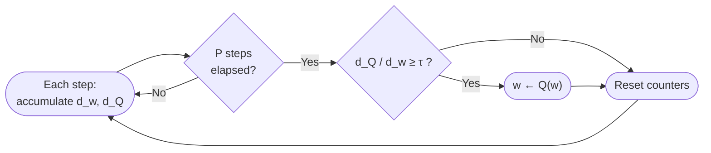

# Training an MoE LLM in MXFP4: How We Closed the Gap to BF16

*A blog-style summary of our full [technical report](./report.md). Code: [ALTO](https://github.com/AMD-AGI/ALTO).*

## Why FP4?

Low-precision training has marched from FP16/BF16 to FP8 and, now, to 4-bit floating point. Under the Open Compute Project's **Microscaling (MX)** spec, MXFP4 stores each value as an E2M1 number (1 sign, 2 exponent, 1 mantissa bit; range ≈ [-6, 6]) with a shared UE8M0 scale per block of 32 elements. The payoff is a **4× smaller operand footprint** than BF16—especially attractive for sparse Mixture-of-Experts (MoE) models, where huge expert matrices dominate compute and memory.

The catch: FP4 quantization error is brutal.

- **Outliers** inflate a block's shared scale, compressing everyone else into a handful of representable levels.
- **Weight oscillation**: over long runs, a master weight can flip its *quantized* value back and forth between adjacent bins even when the full-precision value barely moves.

We set out to train **GPT-OSS-20B** (a 20B-parameter MoE released by OpenAI) under **MXFP4** on the **[MLPerf Small MoE](https://github.com/mlcommons/training/tree/master/small_llm_moe_pretraining/primus)** benchmark—pretraining on a C4 subset with a target validation loss of **3.34**—and get as close to BF16 quality as we could.

## The anatomy of an MXFP4 layer

Every linear layer hides three GEMMs: one in the forward pass (output **O**) and two in the backward pass (activation gradient **dX** and weight gradient **dW**). Each consumes FP4 operands and accumulates in higher precision. On hardware without native MXFP4 GEMMs, ALTO uses **fake quantization**—quantize to MXFP4, immediately dequantize to BF16/FP32, then run a normal GEMM—so we faithfully reproduce FP4's *numerical* error without (yet) realizing its bandwidth savings.

## The recipe that worked

Our recommended stack composes three techniques from [NVFP4 training research](https://arxiv.org/abs/2509.25149) with one stabilizer adapted from [TetraJet-v2](https://arxiv.org/abs/2510.27527):

**1. Hybrid 1D/2D block quantization.** The MX spec only blocks along 1D. That's fine for inference, but training reads weights along *two* different axes (forward vs. backward), which would force two separate 1D quantizations of the same weight. Instead we keep **activations in 1D** (canonical MX, and compatible with RHT) and switch **weights to 2D 32×32 blocks**—so a *single* quantized weight tensor is valid for both the forward and backward pass. Less overhead, no forward/backward mismatch.

**2. Randomized Hadamard Transform (RHT).** A few large activations wreck a block's scale. RHT multiplies by an orthogonal (randomized) Hadamard matrix to spread that outlier energy across coordinates *before* quantizing the gradient path. Because the transform is orthogonal, the underlying gradient is unchanged in expectation:

$$
\mathrm{d}\mathbf{W} = (\mathbf{H}\,\mathrm{d}\mathbf{O})^{\top}(\mathbf{H}\mathbf{X}) = \mathrm{d}\mathbf{O}^{\top}\mathbf{H}^{\top}\mathbf{H}\mathbf{X} = \mathrm{d}\mathbf{O}^{\top}\mathbf{X}.
$$

**3. Stochastic Rounding (SR).** Deterministic rounding systematically kills small gradient components. SR rounds up or down with probability proportional to distance, giving an *unbiased* estimate of the true gradient. On CDNA4 we accelerate it with inline assembly.

**4. Weight de-oscillation.** This is our key stabilizer. Over a window of *P* steps, we track how far each weight travels in full precision ($d_w$) versus how far its *quantized* value travels ($d_Q$). A high ratio $d_Q/d_w$ means the weight is oscillating between bins. We flag those elements and snap them to their bin center ($w \leftarrow Q(w)$). It costs only optimizer-state memory—no extra GEMMs.

**The preferred recipe: `1d2d + RHT + SR + de-oscillation`.**

## Results

On C4 validation at global batch size 16, adding de-oscillation closes **~50%** of the remaining MXFP4→BF16 gap:

| Recipe | Val loss @ 16,128 steps | Gap vs. BF16 |
|--------|--------------------------|--------------|
| BF16 baseline | 3.3283 | — |
| MXFP4 + RHT + SR | 3.3418 | +0.0135 |
| **MXFP4 + RHT + SR + de-oscillation** | **3.3350** | **+0.0067** |

The benefit shows up in the late-training regime, exactly where oscillation accumulates:

The story is clearest when you measure **how fast** each recipe reaches the MLPerf target (validation loss ≤ 3.34). De-oscillation slashes the extra steps FP4 needs relative to BF16:

| Recipe | Extra steps to hit 3.34 (GBS=16) |
|--------|----------------------------------|
| MXFP4 + RHT + SR | +20.0% |
| **+ de-oscillation** | **+5.0%** |

In short: de-oscillation brings FP4 convergence speed to within a *single checkpoint* of BF16.

## What didn't work (the honest part)

We evaluated several other techniques end-to-end—and most didn't pay off at 20B scale:

- **Differential Gradient Estimation (DGE)** — replaces the straight-through estimator with a smooth surrogate for the quantizer's gradient. Marginally better operator SNR, but **severely harmful** end-to-end (+0.20 loss at GBS=16).
- **Dynamic outlier clipping** — large regression (+0.19 loss).
- **Static clipping** and **Macro-Block Scaling (MBS)** — neutral, despite MBS posting the *best* operator-level SNR numbers (+1.2 dB forward).
- **Low-rank outlier compensation** — neutral to slightly harmful at $r=32$ (GBS=16), and it adds per-step GEMMs. Still behind de-oscillation.

Here's DGE's smooth forward/backward surrogate—elegant on paper, but a net loss in practice:

  
  

A recurring lesson: **better synthetic operator-level SNR usually helps, but it doesn't always translate into better end-to-end loss.** Higher operator SNR is a reasonable thing to chase, yet in our runs several techniques that shone in isolated kernel tests turned out neutral—or actively harmful—in full training. If you take one thing from our ablations, let it be this: operator-level SNR is a useful but imperfect proxy, so validate at the *end-to-end training* level, not just the operator level.

## Caveats

All results use **fake-quantized** MXFP4, so they characterize the *numerical* robustness of the recipe, not wall-clock speedups. We haven't fused kernels, optimized throughput, or completed an audited MLPerf submission yet. And everything here is one model family (GPT-OSS-20B) on a C4 subset, on AMD MI300 hardware—generalization to dense models, other FP4 formats, and longer horizons is future work.

## Takeaway

If you're training an MoE in MXFP4, start with **1d2d + RHT + SR**, then add **weight de-oscillation** as your late-training stabilizer. It's cheap (memory only), reliable, and gets you within ~0.007 loss and a single checkpoint of BF16—while recipes that looked better on paper (DGE, MBS, clipping) mostly didn't help.

Full details, formulas, and ablations are in the [technical report](./report.md). The implementation is open-source in [ALTO](https://github.com/AMD-AGI/ALTO).
