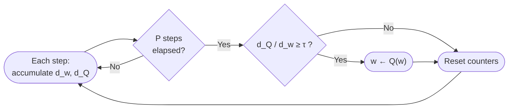

# Training LLM with MXFP4: Techniques and Evaluation on the MLPerf Small MoE Benchmark

---

## Abstract

Training large language models (LLMs) in sub-8-bit arithmetic promises substantial gains in memory bandwidth and compute throughput, yet FP4 formats introduce severe quantization error that can destabilize optimization. We present an open-source training recipe ([ALTO](https://github.com/AMD-AGI/ALTO)) for **GPT-OSS-20B**—a 20-billion-parameter mixture-of-experts (MoE) model—on the **MLPerf Small MoE** benchmark under the **MXFP4** microscaling format. Our recipe composes established techniques from [arXiv:2509.25149]—hybrid 1D/2D block quantization, randomized Hadamard transforms (RHT), and stochastic rounding (SR)—with a simplified weight de-oscillation scheme adapted from TetraJet-v2 [arXiv:2510.27527]. On C4 validation with global batch size 16, **MXFP4 + RHT + SR + de-oscillation** reaches a validation loss of **3.3350** at 16,128 steps, within **0.007** of the BF16 baseline (3.3283)—closing roughly **50%** of the gap left by MXFP4 without de-oscillation (3.3418). Measured by steps to reach the MLPerf quality target (validation loss 3.34), de-oscillation cuts the FP4 convergence overhead relative to BF16 from **+20.0%** to **+5.0%** at GBS=16 and from **+37.5%** to **+12.5%** at GBS=64. We additionally report negative end-to-end results from differential gradient estimation, outlier clipping, and macro-block scaling despite operator-level SNR gains. All experiments employ fake-quantized MXFP4 kernels on AMD MI300 hardware; wall-clock speed has not been optimized.

---

## 1. Introduction

Low-precision training has progressed from FP16 and BF16 to FP8 and, more recently, 4-bit floating-point formats standardized under the Open Compute Project (OCP) Microscaling (MX) specification. MXFP4 encodes weights and activations as E2M1 values with per-block UE8M0 scales, yielding a theoretical 4× reduction in operand footprint relative to BF16. For sparse MoE models such as GPT-OSS-20B, where expert matrices dominate compute and memory, MXFP4 training could unlock disproportionate efficiency gains.

The transition to FP4 is not merely a matter of substituting GEMM kernels. FP4 quantization amplifies sensitivity to tensor outliers; straight-through estimation (STE) of gradients through non-differentiable quantizers introduces bias; and master weights can exhibit *oscillatory* behavior in which the quantized weight jumps between representable values despite negligible movement in full precision—both when individual elements linger near quantization bin boundaries and when outlier magnitudes interact with block-wise scaling to induce repeated bin crossings. These phenomena compound in long-horizon pretraining runs.

This report describes ALTO's methodology for closing the accuracy gap between MXFP4 and BF16 training on the MLPerf Small MoE task. 2D block quantization, randomized Hadamard transforms, and stochastic rounding are adopted from [arXiv:2509.25149] (Section 3.1–3.3). Our focus is on composing these methods into a training recipe suited to MX-format MoE models, implementing them in a unified kernel and modifier stack, and evaluating which combinations matter at GPT-OSS-20B scale. Weight de-oscillation is adapted from TetraJet-v2 [arXiv:2510.27527]; we additionally compare it against low-rank outlier compensation as a design choice. We state explicitly where the implementation remains a research prototype rather than a performance-optimized production system.

---

## 2. Problem Setting

### 2.1 Benchmark: MLPerf Small MoE

We evaluate on the [MLPerf Small MoE training benchmark](https://github.com/mlcommons/training/tree/master/small_llm_moe_pretraining/primus), which specifies pretraining of a sparse MoE LLM from scratch and measuring convergence to a fixed validation-loss target. Our target model is **GPT-OSS-20B**, an open-source 20-billion-parameter mixture-of-experts architecture released by OpenAI.

**Task and model.** The benchmark trains the GPT-OSS-20B MoE model at a sequence length of 8,192 tokens with expert parallelism degree 8. The reference configuration uses a micro batch size of 2, global batch size 16, base learning rate $8 \times 10^{-4}$ with a cosine-decay schedule and warmup, weight decay 0.1, and AdamW ($\beta_1=0.9$, $\beta_2=0.95$, $\epsilon=1\times 10^{-5}$), for up to 1,200,000 training iterations.

**Dataset.** Training and evaluation use the `c4/en/3.0.1` corpus from [HuggingFace/AllenAI](https://huggingface.co/datasets/allenai/c4), provided pre-tokenized. Training reads the `c4-train.en_6_text_document` shards; validation uses the `c4-validation-91205-samples.en_text_document` split. The preprocessed dataset is roughly 80 GB.

**Quality target and evaluation.** The benchmark's convergence criterion is a **validation loss (log perplexity) of 3.34**. Validation is performed every 12,288 samples (768 iterations at GBS=16) over the first 1,024 samples of the validation set. Reference wall-clock time to convergence is approximately 6.5 hours on the specified hardware. We adopt the same task, dataset, target loss, and evaluation cadence, but substitute ALTO's MXFP4/NVFP4 training path and our own quantization-aware hyperparameters (Section 2.2) for the reference BF16 recipe.

### 2.2 Training Protocol

Training hyperparameters follow the ALTO configuration `gpt_oss_20b_pretrain`:

| Hyperparameter | Value |
|----------------|-------|
| Training data | Pre-tokenized C4 subset |
| Validation data | Pre-tokenized C4 validation set |
| Sequence length | 8,192 tokens |
| Global batch size | 16 or 64 |
| Max training steps | 1,200,000 |
| Base learning rate | $4 \times 10^{-4}$ (GBS=16); $1 \times 10^{-4}$ (GBS=64) |
| Min learning rate | $4 \times 10^{-5}$ |
| LR scheduler | cosine decay, 128-step warmup |
| Optimizer | AdamW ($\beta_1=0.9$, $\beta_2=0.95$, weight decay $0.1$) |
| Parallelism | Expert parallelism degree 8; tensor parallelism 1 |

MXFP4 is applied to all `Linear` layers and `GroupedExperts` modules. The `lm_head` projection and MoE router gates are excluded from quantization, as routing decisions are sensitive to small perturbations.

### 2.3 Evaluation Methodology

We evaluate at two levels: operator-level numerical accuracy of individual MXFP4 kernels, and end-to-end validation loss during full-model pretraining.

**End-to-end metric.** We report validation cross-entropy loss on the held-out C4 validation set, measured at regular intervals throughout training. The BF16 baseline (`gpt_oss_20b_pretrain`) uses identical data, hyperparameters, and parallelism, differing only in the absence of MXFP4 quantization in linear and grouped-GEMM forward/backward operations.

**Steps-to-target metric.** In addition to absolute validation loss, we report a convergence-speed metric: the number of training steps required to first reach a validation loss $\leq 3.34$, the MLPerf Small MoE quality target (Section 2.1). Because validation is only recorded at fixed checkpoints (768-step cadence at GBS=16), we report the earliest checkpoint at which the target is met. This metric captures how quickly each low-precision recipe attains the reference quality bar, complementing the final-loss comparison.

**Operator-level metric.** Before scaling to end-to-end runs, we verify that ALTO's MXFP4 Linear and grouped GEMM autograd paths reproduce a high-precision reference. Each configuration is evaluated by running a forward pass and a full backward pass through an MSE loss, then comparing the MXFP4 outputs and gradients against a BF16 reference that performs the same computation without MXFP4 quantization. We report signal-to-noise ratio (SNR) in decibels:

$$
\mathrm{SNR} = 10 \log_{10} \frac{\sum_i \mathbf{X}_i^2}{\sum_i (\mathbf{X}_i - \mathbf{\hat{X}}_i)^2},
$$

where $\mathbf{X}$ is the BF16 reference tensor and $\mathbf{\hat{X}}$ is the MXFP4 result. SNR is computed in FP32 accumulation for numerical stability. We report three quantities per configuration: forward output ($\mathbf{O}$), input gradient ($\mathrm{d}\mathbf{X}$), and weight gradient ($\mathrm{d}\mathbf{W}$).

**Synthetic data with injected outliers.** Operator tests use a fixed synthetic generator designed to stress block-wise quantization under sparse heavy tails—closer to activation/weight statistics during LLM training than i.i.d. Gaussian noise alone. Each tensor is drawn as

$$
\mathbf{T} = \mathcal{N}(0, 1) + \mathrm{Bernoulli}(0.005) \odot \mathcal{N}(0, 10000),
$$

i.e., each element independently receives an additional outlier perturbation with probability $0.5\%$, scaled to roughly 100× standard deviation. Inputs, weights, and loss targets are all generated by this procedure.

---

## 3. Method

We organize accuracy recovery methods into a composable stack. The recommended recipe enables hybrid block quantization, RHT, and SR; weight de-oscillation is optional.

**MXFP4 training paradigm.** MXFP4 is a block-scaled 4-bit format under the OCP Microscaling (MX) specification: each block of 32 consecutive elements shares a UE8M0 scale factor $s$, with elements quantized to E2M1 (one sign, two exponent, and one mantissa bit; approximate range $[-6, 6]$). Given a block $\mathbf{x}$,

$$
s = \frac{\max_i |x_i|}{r_{\max}}, \qquad
\hat{x}_i = \mathcal{Q}_{\mathrm{E2M1}} \left(\frac{x_i}{s}\right), \qquad
\tilde{x}_i = \hat{x}_i \cdot s,
$$

where $\mathcal{Q}_{\mathrm{E2M1}}$ rounds to the nearest representable E2M1 value and $r_{\max}$ is the largest E2M1 magnitude. As illustrated in Figure 1, each linear layer has three underlying GEMMs: a GEMM in the forward pass producing layer output $\mathbf{O}$, and separate GEMMs producing activation gradient ($\mathrm{d}\mathbf{X}$) and weight gradient ($\mathrm{d}\mathbf{W}$) in the backward pass. GEMM operations consume FP4 tensors as inputs and produce outputs in BF16 or FP32. Gradients flow through the quantizer via straight-through estimation (STE) unless modulated by the differential gradient estimation (DGE) below. On hardware without native MXFP4 GEMM support, ALTO performs **fake quantization**—operands are quantized to MXFP4 and immediately dequantized back to BF16/FP32 before a standard high-precision GEMM—faithfully reproducing FP4 numerical error without realizing memory-bandwidth savings (Section 5).

**Figure 1.** Compute flow of an MXFP4 linear layer.

  

Sections 3.1–3.3 describe techniques adopted from [arXiv:2509.25149] and integrated in ALTO. Section 3.4 implements weight de-oscillation as a simplified variant of the OsciReset algorithm in TetraJet-v2 [arXiv:2510.27527]. Sections 3.5–3.8 cover additional methods explored but not retained in the recommended recipe.

### 3.1 Hybrid 1D/2D Block Quantization

**Problem.** The MX specification defines block scaling along contiguous 1D blocks only: each UE8M0 scale is shared by 32 consecutive elements along a single axis. For inference, quantizing each operand once along its contraction axis suffices. Training is more demanding. Consider a linear layer with weight $\mathbf{W} \in \mathbb{R}^{N \times K}$ and forward pass $\mathbf{O} = \mathbf{X}\cdot\mathbf{W}^{\top}$. The forward GEMM contracts along $K$, so $\mathbf{W}$ is naturally quantized with scales aligned to that axis; the backward pass $\mathrm{d} \mathbf{X} = \mathrm{d}\mathbf{O}\cdot\mathbf{W}$ accesses $\mathbf{W}$ along $N$. Under 1D MX blocking, forward and backward demand quantization along different axes. Quantizing $\mathbf{W}$ in 1D therefore requires two separate quantizations along the two axes, which doubles quantization overhead and still leaves the two quantized views inconsistent. Activations present a separate concern: outlier redistribution via RHT (Section 3.2) requires 1D segments and is incompatible with 2D activation blocking.

**Solution.** We adopt a **1D–2D hybrid** layout (denoted *1d2d*) that respects the MX spec for activations while extending it for weights, following [arXiv:2509.25149]:

| Operand | Block geometry | Rationale |
|---------|---------------|-----------|
| Activations $\mathbf{X}$ | 1D (canonical MX; 32-element segments) | Compatible with RHT on the 1D activation path (Section 3.2); lower quantization error |
| Weights $\mathbf{W}$ | 2D (32 × 32 blocks; beyond MX spec) | Single quantization valid for forward and backward; eliminates forward–backward weight discrepancy; lower quantization overhead |

2D block weight quantization partitions $\mathbf{W}$ into 32 × 32 blocks, each sharing one scale. Because the block grid spans both spatial dimensions, the same quantized representation is valid whether $\mathbf{W}$ is consumed in the forward orientation or transposed in the backward pass. As a secondary benefit, 2D blocking reduces quantization overhead: single quantization step for both forward and backward passes, and reduced memory footprint for scale metadata. We adopt 32×32 blocks for MXFP4 format and 16×16 for NVFP4.

For MoE grouped GEMM, expert weights $\mathbf{W} \in \mathbb{R}^{E \times N \times K}$ receive 2D blocking along the final two dimensions. One quantized expert weight tensor is reused across both the forward and the backward kernels, with no axis-dependent re-quantization and no discrepancy between the weight operand presented to the forward and backward graphs.

### 3.2 Randomized Hadamard Transform

**Problem.** A small number of large-magnitude activations (outliers) inflate the per-block scale, compressing the remaining elements and degrading signal fidelity.

**Solution.** Following [arXiv:2509.25149], we apply a **randomized Hadamard transform** (RHT) on the weight gradient path. Let $\mathbf{H} \in \mathbb{R}^{32 \times 32}$ be a Hadamard matrix constructed via Sylvester's recursion, further randomized by random sign flips and column permutations. In the weight-gradient GEMM, activations are transformed as $\mathbf{X}' = \mathbf{H}\mathbf{X}$; the output gradient $\mathrm{d}\mathbf{O}$ is transformed similarly. Because $\mathbf{H}$ is orthogonal (up to scaling), the exact weight gradient satisfies

$$
\mathrm{d}\mathbf{W} = \left(\mathbf{H}\mathrm{d}\mathbf{O}\right)^{\top} \left(\mathbf{H}\mathbf{X}\right) = \mathrm{d}\mathbf{O}^{\top}\mathbf{H}^{\top}\mathbf{H}\mathbf{X} = \mathrm{d}\mathbf{O}^{\top}\mathbf{X}
$$

Because $\mathbf{H}$ is orthogonal (up to scaling), the transform redistributes energy across coordinates without altering the underlying linear operator's gradient in expectation over randomization. RHT is applied exclusively on the 1D activation path and is therefore mutually exclusive with 2D activation blocking—motivating the hybrid layout of Section 3.1.

### 3.3 Stochastic Rounding on Gradients

**Problem.** Deterministic round-to-nearest-even quantization of gradients introduces a systematic bias: small gradient components are disproportionately rounded to zero, attenuating effective learning rates in FP4.

**Solution.** As in [arXiv:2509.25149], we employ **stochastic rounding** (SR) during gradient quantization in the backward pass. Each element is rounded up or down with probability proportional to its fractional distance from the two adjacent representable values, yielding an unbiased estimator of the pre-quantization gradient in expectation. On CDNA4, stochastic rounding is accelerated through inline assembly (`v_cvt_scalef32_sr_pk_fp4_*`). Forward-pass quantization of weights and activations remains deterministic.

### 3.4 Weight De-Oscillation

**Problem.** Weight oscillation arises from two complementary mechanisms. First, when a master weight $w$ resides near a quantization bin boundary, infinitesimal AdamW updates can cause $Q(w)$ to alternate between adjacent bins while the FP trajectory remains smooth. Second, outlier elements—those with disproportionately large magnitude within a block—can drive the block scale and repeatedly push $Q(w)$ across bin boundaries as gradients and neighboring values fluctuate, even when $w$ itself does not sit at a boundary. In both cases, the weight seen by the GEMM oscillates—a pathology analyzed in TetraJet-v2 [arXiv:2510.27527].

**Solution.** We implement a simplified variant of **OsciReset** from TetraJet-v2 [arXiv:2510.27527]. Over a window of $P$ optimizer steps (default $P=200$), we accumulate per-element L1 travel distances:

$$
d_w = \sum_{t=1}^{P} |w_t - w_{t-1}|, \qquad
d_{Q} = \sum_{t=1}^{P} |Q(w_t) - Q(w_{t-1})|.
$$

An element is flagged as oscillating when the distance ratio $\mathrm{DistRatio} = d_{Q} / d_w$ exceeds a threshold $\tau$ (default $\tau=4.0$). This criterion captures both bin-boundary flicker and outlier-induced scale sensitivity, since either mechanism produces large quantized movement relative to small FP movement. At the end of each window, flagged elements are snapped to their current bin center: $w \leftarrow Q(w)$. The procedure is installed as a post-step hook on AdamW and is activated after a warmup of `deosc_step` training steps (default 2,000 for GBS=16 and 800 for GBS=64).

**Figure 2.** Weight de-oscillation core loop (post–AdamW step hook; period $P$, threshold $\tau$).

Compared to TetraJet-v2 [arXiv:2510.27527], our simplification uses a lower threshold ($\tau=4$ vs. $16$), a deferred activation schedule, and restricts scope to parameters wrapped by ALTO's MXFP4/NVFP4 training tensors.

### 3.5 Differential Gradient Estimation (DGE)

**Problem.** The straight-through estimator (STE) back-propagates through FP4 weight quantization as if the quantizer were the identity, discarding all information about local sensitivity within each representable bin. This yields a biased gradient that misrepresents how a weight perturbation actually moves the quantized value. [arXiv:2501.17116] addresses this with a **differentiable gradient estimator** (DGE) that approximates the gradient of the quantization mapping with a smooth function whose magnitude reflects local sensitivity within each bin—but its estimator is not continuous across bin boundaries, introducing discontinuities in the gradient field.

**Solution.** We adopt the DGE concept but use a modified formula: ALTO uses a piecewise power-law surrogate that is continuous between segments. For a value $x$ lying in a bin of width $\delta$ with midpoint $m$, and smoothing parameter $k=5$, we define

$$
f(x) = \left(\frac{\delta}{2}\right)^{1 - 1/k}\cdot\mathrm{sgn}(x - m)\cdot|x - m|^{1/k} + m,
$$

$$
f'(x) = \frac{1}{k}\left(\frac{\delta}{2}\right)^{1 - 1/k}\cdot|x - m|^{1/k - 1},
$$

where $f'(x)$ is clamped to $[0, 3]$ before application. The weight gradient is scaled as

$$
\mathrm{d}\mathbf{W} \leftarrow \mathrm{d}\mathbf{W} \odot f'(\mathbf{W}).
$$

For MXFP4, bin widths $\delta$ and midpoints $m$ are determined by the E2M1 representable grid (15 breakpoints for FP4).

**Figure 3.** DGE forward and backward functions.

  
  

### 3.6 Outlier Clipping

**Problem.** A few large-magnitude elements inflate the per-block scale, consuming representable range and compressing or saturating the remaining elements, which lowers effective precision for the bulk of the distribution.

**Solution.** We cap outliers before quantization to reclaim precision for the majority of elements. Two clipping modes are supported:

- **Static clipping** scales inputs by $3/4$ before quantization and by $4/3$ after dequantization, with a compensating factor of $16/9$ on the weight-gradient path to preserve gradient consistency.
- **Dynamic clipping** follows [arXiv:2502.05003] (*QuEST*): a per-block clipping threshold is estimated from the block standard deviation, $\hat{m} = (2.922/6)\,\mathrm{std}(\mathbf{x}_{\mathrm{block}})$, and requires co-use with RHT in our implementation.

### 3.7 Macro-Block Scaling

**Problem.** A single UE8M0 scale shared by each 32-element MX block is a coarse granularity: when a block contains an outlier, the shared scale is dominated by that element and the remaining values lose precision, so outlier-induced saturation is only partially mitigated by standard MX block scaling.

**Solution.** [arXiv:2603.08713] proposes **Macro Block Scaling (MBS)** as a two-level scheme for MXFP4: a coarse macro-scale is applied before the standard 32-element MX block quantization, allocating higher-precision scaling at a larger granularity to better preserve outliers. Our configuration applies MBS with 128×128 blocks on weights and 1×128 blocks on activations. Within each macro-block, the scale is derived so that the block maximum maps to the largest E2M1 representable magnitude 6.0:

$$
s_{\mathrm{macro}} = \frac{6}{\max_{i \in \mathrm{block}} |x_i|}.
$$

The macro-scale is encoded as a shared mantissa: only the upper 8 mantissa bits of the FP32 scale factor are stored, and the value is reconstructed for pre-scaling before MXFP4 quantization and descaling after dequantization.

### 3.8 Low-Rank Outlier Compensation

**Problem.** FP4 saturation clips the largest-magnitude components of a layer's computation, discarding information carried by a few outlier-dominated directions that a single low-precision GEMM cannot represent.

**Solution.** Following the outlier-compensation paradigm, ALTO can decompose a linear layer into a full MXFP4 GEMM plus a low-rank branch that captures the lost outlier energy:

$$
\mathbf{O} = \mathbf{X}\mathbf{W}^{\top} + \bigl((\mathbf{X}\mathbf{V}) \odot \boldsymbol{\sigma}\bigr)\mathbf{U}^{\top},
$$

where $\mathbf{W}, \mathbf{U}, \mathbf{V}$ are quantized to MXFP4 and $(\mathbf{U}, \mathbf{V}, \boldsymbol{\sigma})$ form a rank-$r$ branch intended to capture information lost to FP4 saturation. Each compensated layer adds two extra MXFP4 parameters ($\mathbf{U}$, $\mathbf{V}$) with one FP32 parameter ($\boldsymbol{\sigma}$) and 6 additional low-rank GEMMs in every forward-backward pass, with cost scaling with $r$. Integration with MoE grouped GEMM is incomplete.

---

## 4. Results

### 4.1 Operator-Level Numerical Accuracy

Table 1 and Table 2 report SNR under the operator-level protocol of Section 2.3.

**Table 1.** SNR (dB) of MXFP4 linear relative to BF16 reference.

| Configuration | Forward $\mathbf{O}$ | Backward $\mathrm{d}\mathbf{X}$ | Backward $\mathrm{d}\mathbf{W}$ |
|---------------|---------|-------------------------------|-------------------------------|
| 1d2d | 13.48 | 11.80 | 13.02 |
| 1d2d + RHT | 13.48 | 11.80 | 13.25 |
| 1d2d + RHT + SR (recommended base) | 13.48 | 11.02 | 13.04 |
| 1d2d + RHT + Static Clipping | 13.48 | 11.80 | 13.22 |
| 1d2d + RHT + SR + Static Clipping | 13.48 | 11.02 | 13.10 |
| 1d2d + RHT + Dynamic Clipping | 13.48 | 11.80 | 13.23 |
| 1d2d + RHT + SR + Dynamic Clipping | 13.48 | 11.02 | 13.06 |
| 1d2d + RHT + MBS | 14.64 | 12.20 | 13.75 |
| 1d2d + RHT + SR + MBS | 14.64 | 12.20 | 14.04 |

**Table 2.** SNR (dB) of MXFP4 grouped GEMM relative to BF16 reference.

| Configuration | Forward $\mathbf{O}$ | Backward $\mathrm{d}\mathbf{X}$ | Backward $\mathrm{d}\mathbf{W}$ |
|---------------|---------|-------------------------------|-------------------------------|
| 1d2d | 13.47 | 12.71 | 12.22 |
| 1d2d + RHT | 13.47 | 12.71 | 12.42 |
| 1d2d + RHT + SR (recommended base) | 13.47 | 12.26 | 12.33 |
| 1d2d + RHT + Static Clipping | 13.47 | 12.71 | 12.12 |
| 1d2d + RHT + SR + Static Clipping | 13.47 | 12.26 | 12.35 |
| 1d2d + RHT + Dynamic Clipping | 13.47 | 12.71 | 12.42 |
| 1d2d + RHT + SR + Dynamic Clipping | 13.47 | 12.26 | 12.32 |
| 1d2d + RHT + MBS | 14.64 | 14.17 | 14.05 |
| 1d2d + RHT + SR + MBS | 14.64 | 13.76 | 13.72 |

**Discussion.**

*Randomized Hadamard transform.* RHT does not alter the forward pass (13.48 dB unchanged) because it is applied only to weight gradients in the backward path. It modestly improves weight-gradient SNR (+0.23 dB linear, +0.20 dB grouped), consistent with redistributing outlier energy before 1D activation-gradient quantization.

*Stochastic rounding.* SR reduces input-gradient SNR by approximately 0.8 dB (11.80 → 11.02 linear; 12.71 → 12.26 grouped) while leaving forward SNR unchanged. This is the expected bias–variance trade-off: SR removes systematic rounding bias at the cost of additional quantization noise in $\mathrm{d}\mathbf{O}$. Weight gradients are essentially unaffected. In end-to-end training (Section 4.2), this local SNR penalty is outweighed by the bias reduction SR provides.

*Outlier clipping.* Static and dynamic clipping, with or without SR, produce SNR within 0.2 dB of the corresponding non-clipping rows. Under this synthetic outlier regime, clipping does not materially improve operator fidelity.

*Macro-block scaling (MBS).* MBS yields the largest operator-level gain: forward SNR rises from 13.5 dB to 14.6 dB (+1.2 dB), and all gradient components improve by 0.4–1.5 dB. On grouped GEMM, MBS boosts $\mathrm{d}\mathbf{X}$ to 14.17 dB—the highest value in Table 2—confirming that coarse shared-mantissa pre-scaling (Section 3.7) mitigates outlier-induced saturation before MX block quantization.

*Recommended quantization configuration.* The recommended configuration (1d2d + RHT + SR) achieves 13.48 / 11.02 / 13.04 dB on linear and 13.47 / 12.26 / 12.33 dB on grouped GEMM—forward fidelity remains strong while accepting the SR-induced penalty documented above.

### 4.2 End-to-End Training

We pretrain GPT-OSS-20B from scratch on a C4 subset under the protocol of Section 2.2, using fake-quantized MXFP4 or NVFP4 GEMMs for all Linear and grouped-expert layers (except the `lm_head` projection and MoE router gates). Validation cross-entropy is measured as described in Section 2.3 at fixed training-step checkpoints. We report two global batch sizes (GBS): 16 (base learning rate $4 \times 10^{-4}$, with de-oscillation enabled at step 2000) and 64 (base learning rate $1 \times 10^{-4}$, with de-oscillation enabled at step 800). All FP4 runs use the 1d2d+RHT+SR recipe unless noted otherwise.

**Main comparison (GBS=16).** Figure 4 tracks four training curves through 16,128 steps. The BF16 baseline reaches a validation loss of 3.3283 at the final checkpoint. The recommended MXFP4 recipe (1d2d + RHT + SR) attains 3.3418, a gap of +0.0135 (+0.41% relative). Adding weight de-oscillation closes half of this gap: the final loss is 3.3350, only +0.0067 above BF16 (+0.20% relative)—a 50% reduction in the MXFP4–BF16 discrepancy relative to the recipe without de-oscillation. At the final checkpoint, MXFP4 + de-oscillation (3.3350) also outperforms NVFP4 + RHT + SR (3.3436).

The benefit of de-oscillation emerges in the late-training regime. At step 13,056, the recommended MXFP4 recipe is slightly ahead (3.3836 vs. 3.3947 with de-oscillation); by step 16,128, de-oscillation pulls ahead by 0.007 loss points (3.3350 vs. 3.3418). This pattern is consistent with TetraJet-V2 [arXiv:2510.27527]'s design: oscillation accumulates over long horizons and is most harmful once the loss enters a fine-grained convergence phase.

**Figure 4.** Validation loss on MLPerf Small MoE (GPT-OSS-20B, C4 subset) with GBS=16.

  

**Larger batch size (GBS=64).** Figure 5 shows that FP4 training is more sensitive at higher throughput. At step 7,680, plain MXFP4 + RHT + SR lags BF16 by +0.072 (3.3468 vs. 3.2746)—roughly 3× the final gap observed at GBS=16. De-oscillation again recovers a substantial fraction of the deficit, reaching 3.2949 (+0.020 vs. BF16). NVFP4 at GBS=64 (3.3083) outperforms plain MXFP4 but remains behind MXFP4 + de-oscillation. These results suggest that both quantization format and stabilization schedule interact with batch-scale / learning-rate choices, and that de-oscillation is especially valuable when per-step noise is higher.

**Figure 5.** Validation loss on MLPerf Small MoE (GPT-OSS-20B, C4 subset) with GBS=64.

  

**Steps to target validation loss $3.34$.** Table 3 reports the earliest tracked checkpoint at which each recipe crosses the MLPerf quality target of 3.34 (Section 2.1). At GBS=16, BF16 reaches the target first; MXFP4 + RHT + SR + de-oscillation follows with only a **+5.0%** step overhead, whereas plain MXFP4 + RHT + SR and NVFP4 + RHT + SR both incur **+20.0%**. At GBS=64, both MXFP4 + de-oscillation and NVFP4 + RHT + SR reach the target at a **+12.5%** overhead, while plain MXFP4 + RHT + SR rises to **+37.5%**. Across both batch sizes, de-oscillation holds the FP4 time-to-target overhead to a relatively low percent.

**Table 3.** Steps to reach validation loss $3.34$ (earliest tracked checkpoint).

| Method | GBS=16 steps | GBS=16 overhead | GBS=64 steps | GBS=64 overhead |
|--------|--------------|-----------------|--------------|-----------------|
| BF16 baseline                            | 15,360 | — | 6,144 | — |
| NVFP4 (1d2d) + RHT + SR                   | 18,432 | +20.0% | 6,912 | +12.5% |
| MXFP4 (1d2d) + RHT + SR                   | 18,432 | +20.0% | 8,448 | +37.5% |
| MXFP4 (1d2d) + RHT + SR + de-oscillation  | 16,128 | +5.0%  | 6,912 | +12.5% |

**Ablation at GBS=16 (step 16,128).** Table 4 isolates individual techniques atop the MXFP4 + RHT + SR base. All ablation rows are drawn from a single sweep in which the shared control (RHT + SR) reaches loss 3.3418; $\Delta$ values are computed relative to this control. Several findings follow directly. **De-oscillation** delivers the largest single improvement ($-0.007$) and achieves the best absolute loss in the ablation. **DGE** and **dynamic clipping** are strongly detrimental ($+0.20$ and $+0.19$, respectively)—far worse than omitting the technique—while **static clipping**, **MBS**, and **low-rank compensation** ($r=32$) are neutral to slightly harmful ($\Delta \approx 0$ to $+0.01$).

**Ablation at GBS=64 (step 7,680).** Table 5 complements the GBS=16 sweep in Table 4. The shared RHT+SR control reaches loss 3.3468; $\Delta$ values are computed relative to this base. **DGE** is again severely harmful ($+0.28$). **Low-rank compensation** is rank-sensitive: $r=32$ is essentially neutral ($\Delta \approx 0$), while $r=128$ yields a clear improvement ($\Delta = -0.017$), reducing validation loss to 3.3294—the best result among the non–de-oscillation methods at this batch scale. **De-oscillation** remains the strongest option ($\Delta = -0.052$; loss **3.2949**), outperforming $r=128$ low-rank compensation by 0.035 loss points without the associated per-step GEMM overhead.

**Table 4.** Ablation of individual techniques (GBS=16, checkpoint 16,128 steps).

| Technique | $\Delta$ loss vs. RHT+SR base | Validation loss |
|-----------|------------------------------|-----------------|
| RHT + SR (recommended base) | — | 3.3418 |
| + DGE | $+0.197$ | 3.5389 |
| + Static clipping | $+0.005$ | 3.3465 |
| + Dynamic clipping | $+0.186$ | 3.5281 |
| + MBS | $\approx 0$ | 3.3419 |
| + Low-rank compensation ($r=32$) | $+0.011$ | 3.3527 |
| + De-oscillation | **$-0.007$** | **3.3350** |

**Table 5.** Ablation of individual techniques (GBS=64, checkpoint 7,680 steps).

| Technique | $\Delta$ loss vs. RHT+SR base | Validation loss |
|-----------|------------------------------|-----------------|
| RHT + SR (recommended base) | — | 3.3468 |
| + DGE | $+0.284$ | 3.6305 |
| + Low-rank compensation ($r=32$) | $\approx 0$ | 3.3449 |
| + Low-rank compensation ($r=128$) | $-0.017$ | 3.3294 |
| + De-oscillation | **$-0.052$** | **3.2949** |

**Summary.** The recommended ALTO recipe for GPT-OSS-20B MXFP4 training is **1d2d + RHT + SR + de-oscillation**. At GBS=16, this configuration approaches BF16 validation loss within 0.007 at 16k steps under fake-quantized MXFP4 execution, and reaches the 3.34 target with only a +5.0% step overhead vs. BF16—versus +20.0% for the other FP4 recipes (Table 3). Techniques that improve synthetic operator SNR—MBS, static clipping—do not translate to better convergence at this scale, while de-oscillation provides a consistent late-training benefit ($\Delta = -0.007$) with only additional optimizer-state memory. At GBS=64, de-oscillation again keeps the steps-to-target overhead to +12.5% vs. BF16 (Table 3), well below plain MXFP4's +37.5%; **low-rank compensation at $r=128$** is a useful accuracy-oriented alternative ($\Delta = -0.017$), though de-oscillation remains preferable when compute efficiency is the priority ($\Delta = -0.052$).

### 4.3 Technique Evaluation and Recipe Selection

This section consolidates end-to-end findings for the recommended stack (Sections 3.1–3.4) and the additional techniques (Sections 3.5–3.8).

**Stochastic rounding.** Despite lowering $\mathrm{d}\mathbf{X}$ SNR by approximately 0.8 dB (Section 4.1), SR remains in the recommended recipe: it removes systematic gradient-quantization bias, and the recommended MXFP4 stack without de-oscillation already reaches validation loss 3.3418 (+0.014 vs. BF16; Figure 4).

**Weight de-oscillation vs. low-rank compensation.** These methods impose qualitatively different costs. Low-rank compensation adds per-step compute that scales with rank $r$ (Section 3.8). De-oscillation adds mainly optimizer-state memory ($d_w$, $d_Q$, and a weight snapshot) with periodic in-place snaps and no extra GEMMs. On AMD MI300/MI355, GPT-OSS-20B training leaves sufficient memory headroom for the auxiliary de-oscillation state without reducing batch size or sequence length.

At GBS=16, de-oscillation delivers the largest ablation improvement ($\Delta = -0.007$; Table 4). Low-rank compensation at $r=32$ is slightly harmful ($\Delta = +0.011$). At GBS=64, $r=128$ yields a meaningful gain ($\Delta = -0.017$; Table 5)—recovering roughly one quarter of the FP4–BF16 gap—but still trails de-oscillation ($\Delta = -0.052$). We therefore adopt **de-oscillation** as the late-training stabilizer; $r=128$ low-rank compensation remains an option when accuracy is paramount and per-step compute is tolerable.

**Differential gradient estimation.** Operator-level tests show marginal SNR improvement on $\mathrm{d}\mathbf{W}$, but validation loss degrades severely ($\Delta = +0.20$; Table 4), confirming that the modified DGE formula (Section 3.5) does not help at GPT-OSS-20B scale.

**Outlier clipping.** Both modes degrade operator-level SNR (Section 4.1). Static clipping is neutral on validation loss ($\Delta \approx +0.005$), while dynamic clipping causes a large regression ($\Delta = +0.19$; Table 4).

**Macro-block scaling.** MBS yields the largest operator-level SNR gains (Section 4.1) but is neutral on validation loss ($\Delta \approx 0$; Table 4).

**Operator–end-to-end gap.** Higher synthetic operator SNR is generally expected to benefit end-to-end training, but the correspondence is not guaranteed. In our experiments this link breaks down: **MBS** and **static clipping** raise operator SNR yet only marginally affect—or fail to improve—validation loss at GBS=16, while **DGE** and **dynamic clipping** are actively harmful. This indicates that operator-level SNR is a useful but imperfect proxy for end-to-end quality at GPT-OSS-20B scale. **De-oscillation** provides the most reliable late-training benefit among the techniques evaluated, with low-rank compensation at $r=128$ as a compute-heavy alternative at GBS=64.

**Preferred recipe.** Weighing final validation loss (Figure 4, Figure 5), steps-to-target (Table 3), and compute/memory cost, the technique combination we prefer for GPT-OSS-20B FP4 training is **MXFP4 with 1d2d hybrid block quantization + RHT + SR + weight de-oscillation**. This stack delivers the best FP4 accuracy at GBS=16, keeps the steps-to-target overhead to just +5.0% (GBS=16) and +12.5% (GBS=64) relative to BF16 (Table 3), and adds only optimizer-state memory (no extra GEMMs). The remaining techniques of Sections 3.5–3.8 are not included in the preferred recipe; low-rank compensation at $r=128$ is the sole accuracy-oriented fallback when per-step compute is not a concern.

---

## 5. Limitations

We state the principal limitations of the present work explicitly.

**Fake-quantized execution.** The current ALTO implementation emulates MXFP4 training through per-operator quantization-dequantization (QDQ) round trips on platforms without native MXFP4 GEMM. This design correctly models the numerical error budget of FP4 training but does not exercise the memory-bandwidth or compute savings of true FP4 MatrixCore execution. Consequently, all accuracy results in this report characterize algorithmic robustness of the proposed techniques, not the end-to-end behavior of a fused hardware stack.

**Wall-clock performance.** The training path has not been optimized for throughput. Each linear and grouped-GEMM layer incurs separate kernel launches for quantization/dequantization, RHT and GEMM. Auxiliary operations such as RHT are not fused with quantization or GEMM. Among the techniques evaluated here, low-rank outlier compensation is the primary source of auxiliary compute cost, adding per-layer GEMMs on every training step; weight de-oscillation adds mainly memory cost through extra optimizer-state tensors—a modest increase that fits within available memory headroom on AMD MI300/MI355 hardware under our GPT-OSS-20B configuration. We therefore do not report training-time speedup over BF16: any observed wall-clock ratio would reflect prototype overhead rather than the theoretical advantage of MXFP4 arithmetic. A production implementation would require operator fusion, persistent MXFP4 buffer management, and elimination of redundant quantization/dequantization.

**Scope of evaluation.** Results are reported for a single model family (GPT-OSS-20B MoE) on a C4 subset, on AMD MI300 accelerators. Generalization to dense architectures, other FP4 formats, and longer training horizons remains to be established. DGE, clipping, and macro-block scaling [arXiv:2603.08713] may warrant re-evaluation under different hyperparameter regimes; low-rank compensation at $r=128$ shows promise at GBS=64 (Table 5) but requires further study at GBS=16 and on grouped GEMM.

**Incomplete MLPerf submission.** While our training protocol is aligned with the MLPerf Small MoE specification, we have not yet completed a formal MLPerf Training submission with audited throughput and convergence criteria.

---

## 6. Conclusion

We have described an ALTO recipe for training GPT-OSS-20B under MXFP4 on the MLPerf Small MoE benchmark. **2D block quantization, RHT, and SR** are adopted from [arXiv:2509.25149] and form a strong baseline; at GBS=16 and 16,128 steps, this stack reaches validation loss 3.3418 versus 3.3283 for BF16 (+0.014). **Weight de-oscillation**, adapted from OsciReset in TetraJet-v2 [arXiv:2510.27527], closes half of the remaining gap—final loss **3.3350** (+0.007 vs. BF16)—with only modest additional optimizer-state memory and no extra GEMMs. It also sharply reduces the steps-to-target overhead: reaching the 3.34 quality target costs only **+5.0%** more steps than BF16 at GBS=16 (down from **+20.0%** for plain MXFP4) and **+12.5%** at GBS=64 (down from **+37.5%**).

Our ablations reveal that higher synthetic operator SNR does not always translate into better end-to-end training: **MBS** and **static clipping** raise operator SNR but do not improve validation loss at GBS=16, while **DGE** and **dynamic clipping** are actively harmful at scale. **Low-rank compensation** is rank-sensitive: $r=32$ is neutral to slightly harmful at GBS=16, but $r=128$ improves validation loss by 0.017 at GBS=64—a meaningful gain, though still behind **de-oscillation** ($\Delta = -0.052$) in both accuracy and compute efficiency. At GBS=64, the FP4 deficit widens but de-oscillation again recovers most of the loss gap, supporting its use as the late-training stabilizer in the recommended recipe: **1d2d + RHT + SR + de-oscillation**.

Future work will fuse quantization and transforms into a single kernel pipeline, enable FP4 dispatch in expert parallelism, and pursue audited MLPerf Training submission on native FP4 hardware.

---

## References

[1] AMD AIG. [ALTO: Advanced Low-precision Training and Optimization](https://github.com/AMD-AGI/ALTO).

[2] Open Compute Project. [OCP Microscaling Formats (MX) Specification](https://www.opencompute.org/documents/ocp-microscaling-formats-mx-specification-v0-5-pdf).

[3] MLCommons. [GPT-OSS-20B Pretraining Benchmark](https://github.com/mlcommons/training/tree/master/small_llm_moe_pretraining/primus).

[4] Wang, Y., et al. "Optimizing Large Language Model Training Using FP4 Quantization." *arXiv preprint [arXiv:2501.17116](https://arxiv.org/abs/2501.17116)*, 2025.

[5] Panferov, V., et al. "QuEST: Stable Training of LLMs with 1-Bit Weights and Activations." *arXiv preprint [arXiv:2502.05003](https://arxiv.org/abs/2502.05003)*, 2025.

[6] NVIDIA Research. "Pretraining Large Language Models with NVFP4." *arXiv preprint [arXiv:2509.25149](https://arxiv.org/abs/2509.25149)*, 2025.

[7] Chen, Z., et al. "TetraJet-v2: Accurate NVFP4 Training for Large Language Models with Oscillation Suppression and Outlier Control." *arXiv preprint [arXiv:2510.27527](https://arxiv.org/abs/2510.27527)*, 2025.

[8] Chhugani, N., et al. "Unveiling the Potential of Quantization with MXFP4: Strategies for Quantization Error Reduction." *arXiv preprint [arXiv:2603.08713](https://arxiv.org/abs/2603.08713)*, 2026.

---

*Draft based on ALTO v0.0.1. End-to-end results reported at 16k steps (GBS=16) and 7.7k steps (GBS=64) on AMD MI300 accelerators under fake-quantized MXFP4 execution.*
