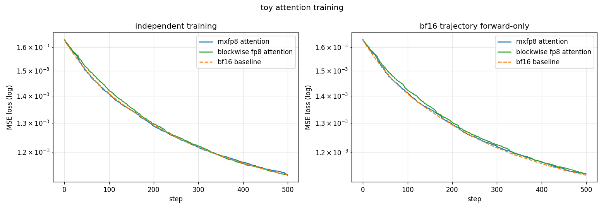
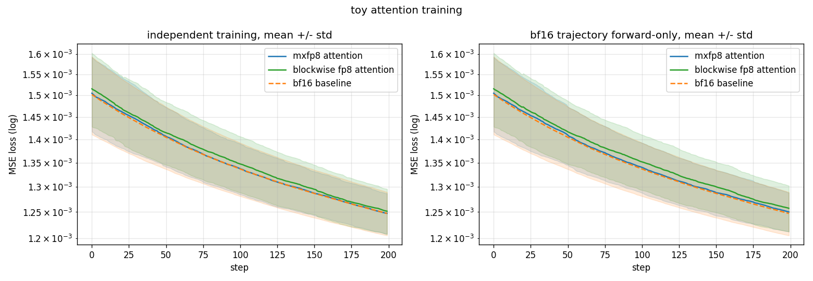

# MXFP8 Attention Toy E2E Experiment Report

## 1. Executive Summary

本次实验评估 `mxfp8 attention kernel` 放进一个最小训练任务后，是否能稳定训练，以及它相对 `bf16 SDPA baseline` 的真实数值误差有多大。对照组是 `blockwise_fp8 attention`。

结论：

- `mxfp8 attention` 能完成 Toy-Attention 训练，loss 稳定下降，无 NaN/Inf。
- 在**同一条 bf16 权重轨迹**上做 forward-only 对比，`mxfp8 attention` 相对 bf16 的平均相对误差为 `0.29%`（单 seed 500 步）/ `0.42%`（5 seed 200 步）。
- 同一口径下 `blockwise_fp8 attention` 为 `0.71%` / `0.96%`。**mxfp8 的数值误差约为 blockwise_fp8 的一半。**
- `blockwise_fp8` 的误差是**系统性偏高**（98.6%~99.8% 的步数 loss 高于 bf16）；`mxfp8` 的偏差更接近**对称噪声**（66%~88% 的步数偏高），没有明显单向偏置。
- **不能声称 mxfp8 在训练质量上优于或劣于 bf16。** 独立训练曲线上谁高谁低完全是噪声，详见第 5 节。

曲线图（单 seed 1234 / 500 步）：



曲线图（5 seed / 200 步，mean ± std）：



## 2. Background

最初已有的实验是 Toy-MoE，用来验证 `mxfp8 grouped_gemm`：

- MoE 的核心数据结构是 `inputs + expert_weights + expert_indices`。
- Attention 的核心数据结构是 `Q/K/V` 序列张量。

所以没有把 MoE 实验硬改成 attention 实验。那样会把 routing、expert、group size 等无关变量混进来，结论会变脏。

本次是一个专门的 Toy-Attention teacher-student 实验：teacher 用 bf16 SDPA 生成 target，student 用相同初始权重、不同 attention kernel，对比 MSE loss。

## 3. Experiment Setup

文件：

- `tests/unittest/mxfp8/e2e_attention_precision/e2e_attention_common.py` — 配置、模型、两种实验的共享实现
- `tests/unittest/mxfp8/e2e_attention_precision/test_e2e_attention.py` — pytest smoke test
- `tests/unittest/mxfp8/e2e_attention_precision/plot_e2e_attention_curve.py` — 跑实验并出图
- `tests/unittest/mxfp8/e2e_attention_precision/runs/<run_name>/` — 每次 run 的 PNG + 原始 loss JSON

模型配置（`AttentionExperimentConfig` 默认值）：

| 参数 | 值 |
| --- | --- |
| batch | `1` |
| sequence length | `128` |
| heads | `4` |
| head dim | `64` |
| model dim | `256` |
| dtype | `torch.bfloat16` |
| learning rate | `0.5`（plain SGD） |
| causal | `True` |
| input / weight / student-noise scale | `0.5` / `0.05` / `0.02` |

对比路径：

- `mxfp8 attention`: `alto.kernels.mxfp8.triton_flash_attention_mxfp8.triton_attention_mxfp8`
- `blockwise fp8 attention`: `alto.kernels.blockwise_fp8.triton_flash_attention_fp8_block.triton_attention_block(..., use_fp8=True)`
- `bf16 baseline`: `torch.nn.functional.scaled_dot_product_attention`

`mxfp4 attention` 曾短暂加入后删除：它不是本次对比目标，且 backward 当前为空实现，不适合做训练曲线对比。

### 3.1 两种实验，回答两个不同的问题

图里是两张子图，不要混淆它们的含义。

**左图 `independent training`（`run_training_experiment`）**

三套完全相同的初始权重，各自独立训练。每条路径的 forward **和 backward** 都走自己的 kernel，梯度由自己算，权重按自己的梯度更新。三条线跑的是**三条不同的优化轨迹**。

它只回答一个问题：**这个 kernel 接进训练循环能不能跑通、会不会炸。**

**右图 `bf16 trajectory forward-only`（`run_forward_only_experiment`）**

只有一套权重，**永远由 bf16 更新**。每步更新前把权重冻住，让三个 kernel 在**完全相同的权重**上各做一次 forward，各记一个 loss。

它回答的是：**排除优化轨迹分叉后，这个 kernel 本身的数值误差有多大。**

这两个实验不可互相替代。想比精度只能看右图。

## 4. Results

在 Docker 容器 `hungry_sanderson` 中运行：

```bash
cd /workspace/ALTO
python -m pytest tests/unittest/mxfp8/e2e_attention_precision/test_e2e_attention.py -q -s
python tests/unittest/mxfp8/e2e_attention_precision/plot_e2e_attention_curve.py --steps 500 --num-seeds 1 --run-name single_seed1234_500step
python tests/unittest/mxfp8/e2e_attention_precision/plot_e2e_attention_curve.py --steps 200 --num-seeds 5 --show-std-band --run-name robust_5seed_200step
```

### 4.1 最终 loss

Run A：单 seed `1234`，500 步。

| path | independent training | forward-only |
| --- | --- | --- |
| `mxfp8 attention` | `0.00112863` | `0.00113188` |
| `blockwise fp8 attention` | `0.00112651` | `0.00113251` |
| `bf16 baseline` | `0.00112817` | `0.00112817` |

Run B：5 seeds，200 步，跨 seed 均值。

| path | independent training | forward-only |
| --- | --- | --- |
| `mxfp8 attention` | `0.00124750` | `0.00125013` |
| `blockwise fp8 attention` | `0.00125160` | `0.00125738` |
| `bf16 baseline` | `0.00124729` | `0.00124729` |

### 4.2 相对 bf16 的逐步误差（核心指标）

对每一步、每个 seed 计算 `|loss_kernel - loss_bf16| / loss_bf16`。

| run / 实验 | kernel | 平均相对误差 | 最大相对误差 | 高于 bf16 的步数占比 |
| --- | --- | --- | --- | --- |
| A / training | `mxfp8` | `0.19%` | `0.70%` | `52.8%` |
| A / training | `blockwise` | `0.40%` | `1.26%` | `74.8%` |
| A / forward-only | `mxfp8` | `0.29%` | `0.87%` | `88.4%` |
| A / forward-only | `blockwise` | `0.71%` | `1.52%` | `99.8%` |
| B / training | `mxfp8` | `0.33%` | `1.49%` | `51.3%` |
| B / training | `blockwise` | `0.68%` | `2.06%` | `95.9%` |
| B / forward-only | `mxfp8` | `0.42%` | `1.58%` | `66.2%` |
| B / forward-only | `blockwise` | `0.96%` | `2.09%` | `98.6%` |

两个 run、两种实验，四组口径下 `mxfp8` 的误差都稳定在 `blockwise` 的一半左右。这是本次实验唯一站得住的定量结论。

### 4.3 配对差值（Run B，5 seeds，终点）

跨 seed 求均值会被 seed 方差淹没，所以按 seed 配对求 `kernel - bf16`：

| 实验 | kernel | 配对差均值 | 配对差 std | 5 个 seed 的符号 |
| --- | --- | --- | --- | --- |
| training | `mxfp8` | `+2.2e-07` | `3.9e-06` | `- - + + -` |
| training | `blockwise` | `+4.3e-06` | `4.6e-06` | `+ + + + -` |
| forward-only | `mxfp8` | `+2.8e-06` | `6.3e-06` | `+ - + + -` |
| forward-only | `blockwise` | `+1.0e-05` | `4.7e-06` | `+ + + + +` |

对照：bf16 自身终点 loss 的跨 seed std 是 `4.2e-05`。

## 5. Interpretation

### 5.1 独立训练曲线的高低排名是噪声，不要引用

Run A（单 seed 500 步）左图里，终点排名是 `blockwise < bf16 < mxfp8`。而本报告上一版（40 步）的排名是 `mxfp8 < bf16 < blockwise`，**完全相反**。同一个实验只改步数排名就翻转。

Run B 的逐 seed 数据给出了原因：独立训练时 `mxfp8` 高于 bf16 的步数占比是 `51.3%`，5 个 seed 里 2 个终点更高、3 个更低。**这就是抛硬币。** 配对差均值 `2.2e-07`，比配对差自身的 std（`3.9e-06`）小一个量级，更比 seed 间 std（`4.2e-05`）小两个量级。

机制很简单：三条轨迹一旦分叉，量化误差就变成随机扰动，谁运气好谁低一点，和精度好坏无关。

**汇报禁止出现的说法**：mxfp8 比 bf16 好 / bf16 比 mxfp8 好 / mxfp8 比 blockwise 训练效果好（基于左图）。

### 5.2 forward-only 才是诚实的测量，两个 kernel 的差别在这里显形

同一套权重下，`blockwise_fp8` 在 `98.6%`~`99.8%` 的步数上 loss 高于 bf16，5 个 seed 终点全为正——这是**系统性偏差**，量化误差稳定地把结果推离 target。

`mxfp8` 是 `66%`~`88%`，5 个 seed 里有 2 个终点低于 bf16——偏差方向不稳定，更接近**对称噪声**，量级也只有 blockwise 的一半。

补充说明"为什么 fp8 的 loss 可能低于 bf16"：loss 是对 bf16 teacher target 的 MSE，此时 student 远未收敛，残差 `r` 远大于量化噪声 `ε`。展开 `‖r+ε‖² = ‖r‖² + 2⟨r,ε⟩ + ‖ε‖²`，交叉项 `2⟨r,ε⟩` 符号随机且量级压过 `‖ε‖²`。所以 loss 往下掉纯属噪声走运，**不代表精度更高**。

### 5.3 5-seed 图的 std 阴影带不能用来比 kernel

Run B 图里三条阴影带几乎完全重叠。原因是阴影带宽度由 **seed 间方差**（`4.2e-05`）决定，而 kernel 间差异只有 `2e-07`~`1e-05`，小 4~200 倍。带子重叠**不代表**三个 kernel 等价，只代表这种画法看不出区别。要比 kernel 必须用 4.2 / 4.3 节的配对口径。

### 5.4 本实验能说明与不能说明的

能说明：

- `mxfp8 attention` 的 forward/backward 接入训练路径后无数值失稳。
- 同轨迹下 `mxfp8` 的数值误差约 `0.3%~0.4%`，是 `blockwise_fp8` 的一半。
- `blockwise_fp8` 存在系统性正偏差，`mxfp8` 没有。

不能说明：

- 不能说明 `mxfp8` 训练质量优于 bf16。
- 不能说明大模型训练中一定稳定。
- 不能说明所有 shape / seed / causal 场景都稳定（当前只覆盖 `seqlen=128, head_dim=64, causal=True`）。
- 不能说明性能速度，本实验只看 loss，无 timing benchmark。

## 6. Code Quality Assessment

【品味评分】🟢 好品味。

理由：

- 没有复用 Toy-MoE 的错误数据结构，attention 实验只保留 Q/K/V、causal、head_dim。
- `PATHS` 字典统一管理对比路径，避免为每个 kernel 写一套训练循环。
- 训练逻辑抽到 `e2e_attention_common.py`，pytest 和 plot 脚本共用，消除了上一版的重复代码。
- 每次 run 输出到独立目录并落 JSON 原始 loss 序列，图可复查。
- 加了 forward-only 同轨迹实验，把"kernel 数值误差"和"优化轨迹噪声"这两件事拆开了。这是本次最关键的设计改动。

【仍然粗糙的地方】

- 只覆盖一个 shape。
- 图上画的是 mean ± std，但 5.3 节已说明这个口径看不出 kernel 差异。图缺一张配对差值（`kernel - bf16` per seed）的子图。
- pytest 只断言"有限 + 下降 + 不超过 bf16 两倍"，阈值太松，抓不到精度回归。

## 7. Recommended Next Steps

短期（保持现状即可）：

- 保留 pytest 作为 smoke test：确认低精度 attention 能训练、不炸。
- 保留 plot 脚本作为人工检查工具。
- 汇报只引用 4.2 节的相对误差表，不要引用任何终点 loss 排名。

提高可信度：

- 给图加一张配对差值子图，取代或补充当前的 std 阴影带。
- 增加多 shape：`seqlen=128/512/1024`，`head_dim=64/128`，并测 `causal=False`。
- 把 pytest 阈值从"不超过 bf16 两倍"收紧到"平均相对误差 < 1%"，让精度回归能被 CI 抓到。
- 单独做 latency/throughput benchmark，不要和训练 loss 混在一个实验里。

Owner 与截止：

- Owner: MXFP8 attention kernel owner
- 截止: 下一轮 kernel 汇报前
- 最小交付: 4.2 节相对误差表 + 两张曲线图 + pytest 结果

## 8. Bottom Line

推荐的汇报结论：

> 在 Toy-Attention teacher-student 任务中，`mxfp8 attention` 可以稳定完成训练，无数值失稳。在同一条 bf16 权重轨迹上做 forward-only 对比时，`mxfp8` 相对 bf16 SDPA 的平均相对误差为 `0.3%~0.4%`，约为 `blockwise_fp8 attention`（`0.7%~1.0%`）的一半，且不存在后者那种系统性偏差。本结果验证了 mxfp8 attention 的基本训练可用性与相对精度优势；但实验仅覆盖单一 shape 与 5 个 seed，且独立训练曲线上的 loss 高低差异在噪声范围内，因此不能宣称 mxfp8 在训练质量上优于 bf16。
